# Installer Windows et Ubuntu sur un vrai PC avec une clé USB

> **Jean-Pierre Gallego Santillan** · Apprenti informaticien CFC · Classe E1A · Septembre 2026

TP fait en classe sur un PC Lenovo : préparer une clé USB bootable avec Rufus, passer par le BIOS pour démarrer dessus, puis lancer l'installation de Windows 11, et refaire la même chose avec Ubuntu.

## Sommaire

- [1. Créer la clé USB d'installation de Windows avec Rufus](#1-créer-la-clé-usb-dinstallation-de-windows-avec-rufus)
- [2. Démarrer sur la clé USB depuis le BIOS](#2-démarrer-sur-la-clé-usb-depuis-le-bios)
- [3. Installer Windows](#3-installer-windows)
- [4. Créer la clé USB Ubuntu et démarrer l'installation](#4-créer-la-clé-usb-ubuntu-et-démarrer-linstallation)

---

## 1. Créer la clé USB d'installation de Windows avec Rufus

Rufus est un logiciel gratuit qui permet de préparer une clé USB bootable à partir d'un fichier ISO, afin d'installer un système d'exploitation sur un ordinateur.

1. Installer Rufus sur l'ordinateur, puis le lancer.
2. Brancher la clé USB, vérifier qu'elle est bien sélectionnée dans « Périphérique », puis choisir le fichier ISO de Windows (ici Win11_24H2_French_x64.iso) via le menu « Type de démarrage ».

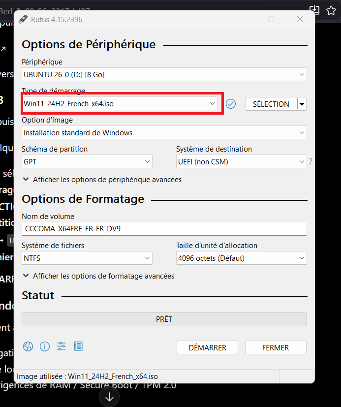

*Sélection de l'image ISO de Windows dans Rufus.*

3. Vérifier les options proposées (schéma de partition GPT, système de destination UEFI, nom de volume), puis cliquer sur « Démarrer » pour lancer la création de la clé.

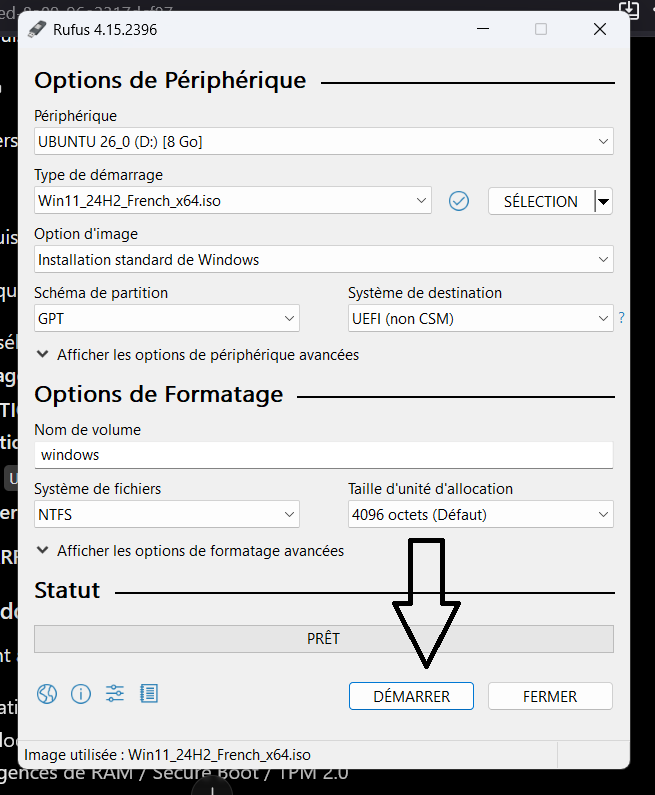

*Lancement de la création de la clé avec le bouton « Démarrer ».*

4. Une fenêtre « Expérience de l'utilisateur Windows » propose des options pour personnaliser l'installation, par exemple supprimer l'obligation d'avoir 4 Go de RAM / Secure Boot / TPM 2.0, ou ne pas exiger de compte Microsoft en ligne. Cocher les options souhaitées puis valider avec « OK ».

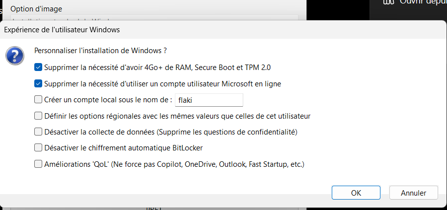

*Options de personnalisation de l'installation de Windows proposées par Rufus.*

5. Rufus copie ensuite les fichiers de l'ISO sur la clé USB : il faut patienter jusqu'à la fin de la barre de progression avant de débrancher la clé.

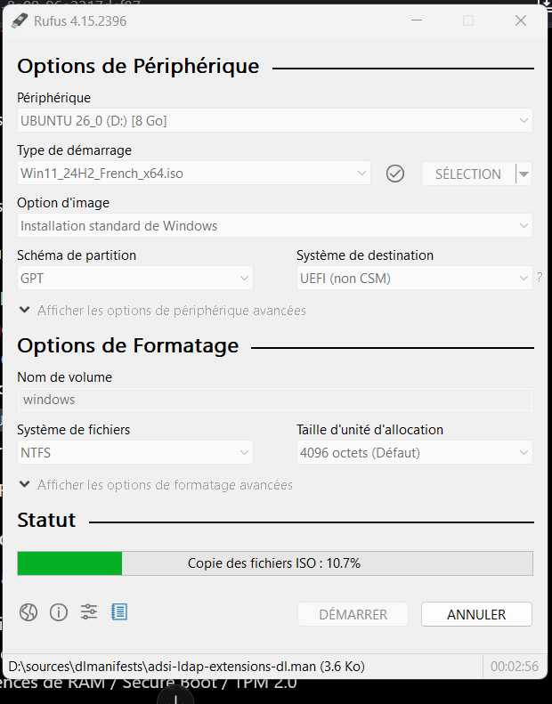

*Copie des fichiers de l'ISO en cours sur la clé USB.*

## 2. Démarrer sur la clé USB depuis le BIOS

6. Brancher la clé USB sur l'ordinateur cible, puis démarrer (ou redémarrer) la machine.
7. Appuyer sur la touche F12 pendant le démarrage pour accéder au BIOS (la touche d'accès peut varier selon la marque de l'ordinateur).
8. Dans le BIOS, se rendre dans l'onglet « Startup », puis ouvrir « Primary Boot Sequence ».

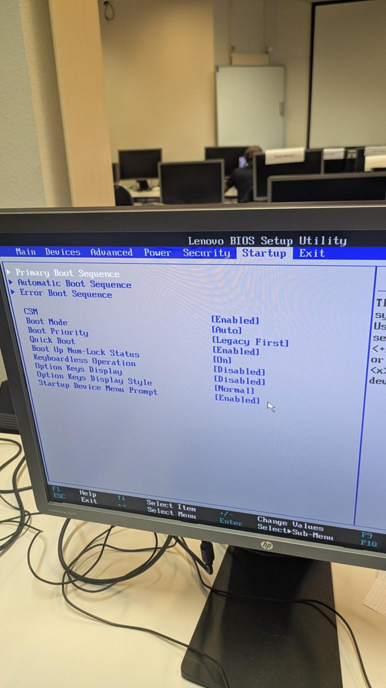

*Onglet « Startup » du BIOS Lenovo, où se trouve l'ordre de démarrage.*

9. Dans la liste, sélectionner la clé USB (« USB KEY 1 ») comme premier périphérique de démarrage, puis valider et quitter en enregistrant (touche F10) pour lancer l'installation.

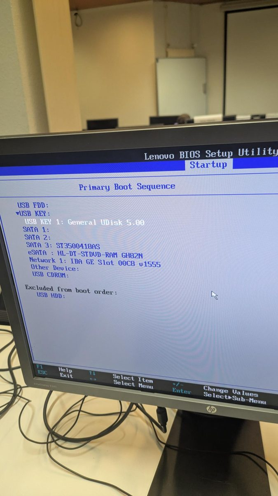

*Choix de la clé USB comme premier périphérique dans « Primary Boot Sequence ».*

## 3. Installer Windows

10. Une fois démarré sur la clé, le programme d'installation de Windows se lance : choisir la langue et les paramètres régionaux, puis appliquer les paramètres et suivre les étapes affichées à l'écran jusqu'à la fin de l'installation.

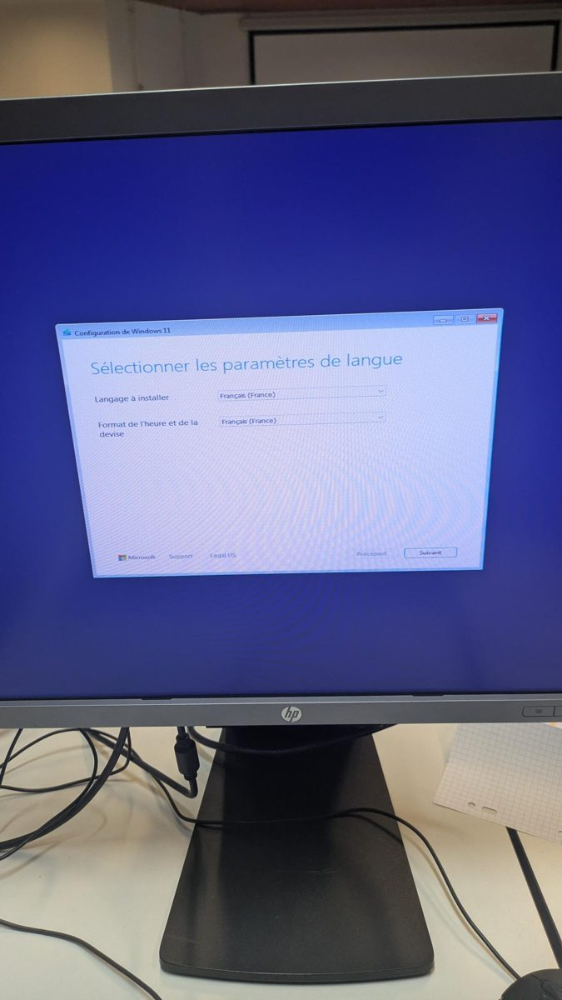

*Écran de sélection de la langue au démarrage de l'installation de Windows.*

## 4. Créer la clé USB Ubuntu et démarrer l'installation

Pour Ubuntu, on reprend le même principe avec Rufus, en changeant simplement l'image ISO utilisée.

11. Dans Rufus, sélectionner la clé USB puis choisir l'ISO d'Ubuntu (ici ubuntu-26.04-desktop-amd64.iso). Choisir un schéma de partition adapté (MBR, système de destination « BIOS ou UEFI ») puis cliquer sur « Démarrer ».

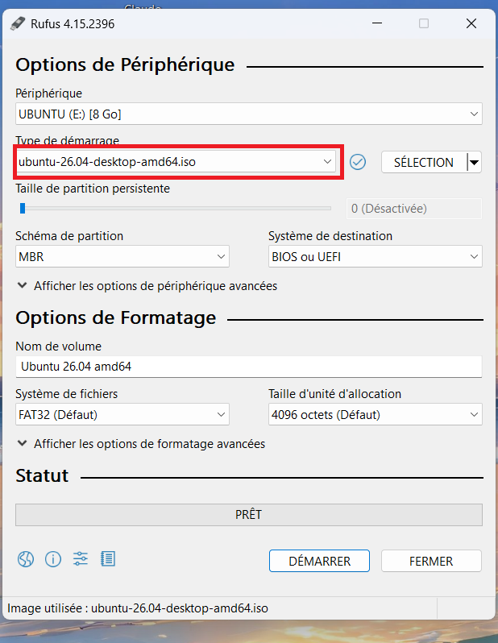

*Sélection de l'ISO Ubuntu dans Rufus.*

12. Rufus partitionne puis formate la clé avant d'y copier les fichiers d'Ubuntu : il faut là aussi attendre la fin de l'opération.

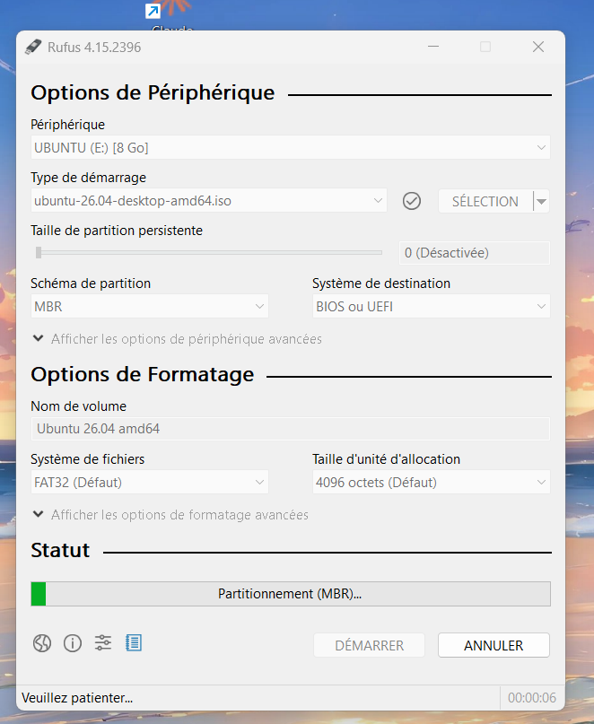

*Partitionnement (MBR) et copie des fichiers d'Ubuntu en cours.*

13. Brancher la clé sur le PC cible et démarrer dessus via le BIOS, comme expliqué à l'étape 2. L'écran de démarrage d'Ubuntu s'affiche.

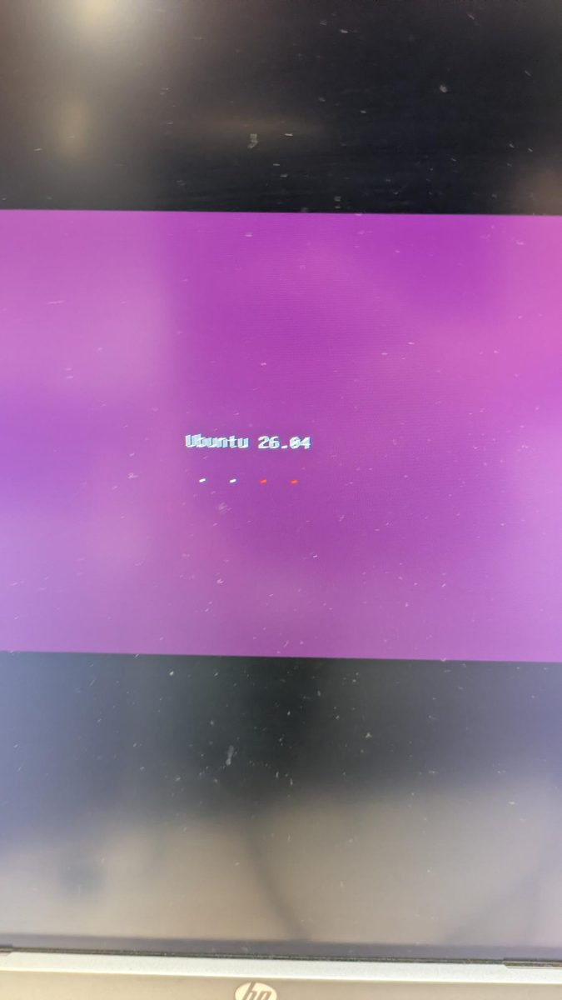

*Écran de démarrage d'Ubuntu 26.04.*

14. Le système démarre ensuite ses différents services (réseau, impression, snap, etc.), visibles dans le journal de démarrage, avant d'ouvrir l'assistant d'installation.

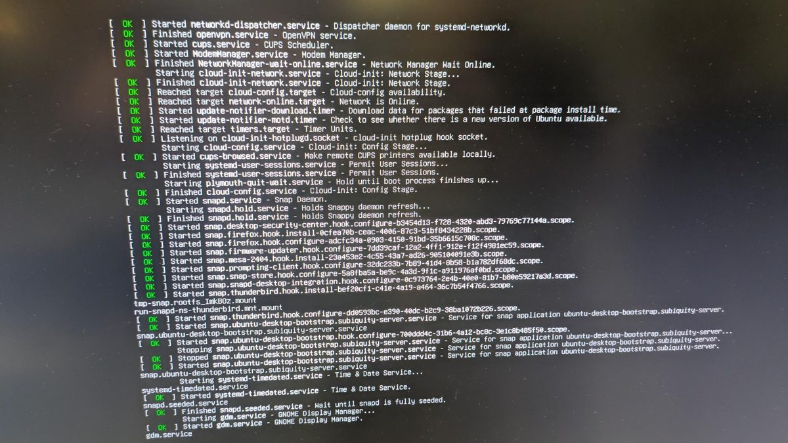

*Journal de démarrage des services système d'Ubuntu.*

15. L'assistant « Welcome to Ubuntu » s'affiche : choisir la langue d'installation, cliquer sur « Next », puis suivre les étapes suivantes de l'assistant (clavier, disque, compte utilisateur, etc.) pour terminer l'installation.

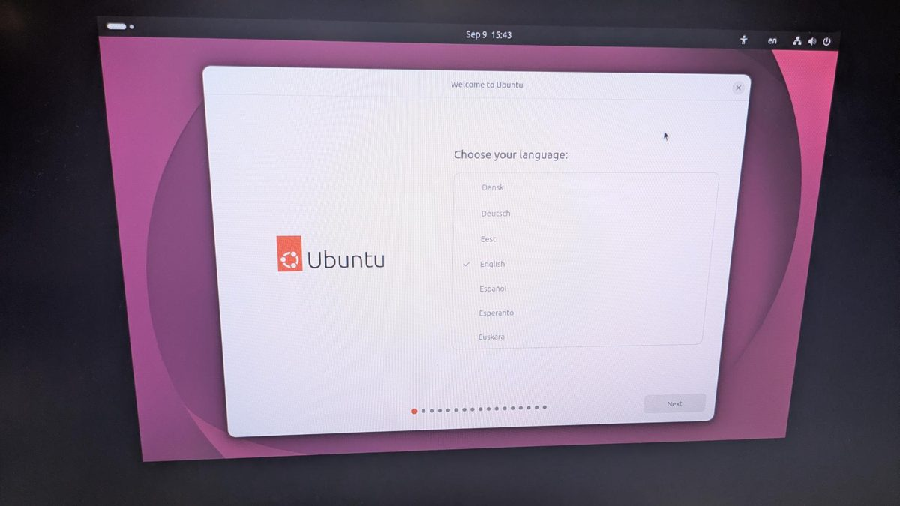

*Écran d'accueil et choix de la langue de l'installateur Ubuntu.*

Une fois l'assistant terminé, il suffit de suivre les indications restantes (partitionnement du disque, création du compte utilisateur, etc.) pour finaliser l'installation.

---

**[⬅ Retour aux projets](../README.md)** · [Mon profil](https://jp-gallego.github.io) · [LinkedIn](https://www.linkedin.com/in/jean-pierre-gallego-santillan-6b4701433)
