# Projet 1 — Mise en service d'un poste de travail

> **Jean-Pierre Gallego Santillan** · Apprenti informaticien CFC · IT Essentials ICT-187 · Classe E1A · Septembre 2026

Mon premier projet de la formation. Le scénario : un petit cabinet comptable de trois personnes accueille une nouvelle employée, Natasha, et son PC doit être prêt le lundi matin. J'ai tout fait dans une machine virtuelle VMware : installation de Windows 10 Pro, réglages suisses, comptes, logiciels, IP fixe, imprimante et sécurité.

En relisant, j'ai trouvé trois choses que j'aurais dû faire autrement. Je les ai laissées dans le rapport (section 12), parce que c'est aussi comme ça que j'apprends.

## Sommaire

- [1. Contexte et objectifs](#1-contexte-et-objectifs)
- [2. Création de la machine virtuelle et installation de Windows 10](#2-création-de-la-machine-virtuelle-et-installation-de-windows-10)
- [3. Paramètres régionaux, langue et clavier](#3-paramètres-régionaux-langue-et-clavier)
- [4. Mises à jour de Windows](#4-mises-à-jour-de-windows)
- [5. Création des comptes utilisateurs](#5-création-des-comptes-utilisateurs)
- [6. Installation des logiciels métier](#6-installation-des-logiciels-métier)
- [7. Configuration réseau : adresse IP fixe](#7-configuration-réseau--adresse-ip-fixe)
- [8. Nom de la machine et groupe de travail](#8-nom-de-la-machine-et-groupe-de-travail)
- [9. Ajout de l'imprimante et test d'impression](#9-ajout-de-limprimante-et-test-dimpression)
- [10. Sécurisation du poste](#10-sécurisation-du-poste)
- [11. Fiche de mise en service](#11-fiche-de-mise-en-service)
- [12. Bilan et points d'amélioration](#12-bilan-et-points-damélioration)
- [13. Glossaire](#13-glossaire)

---

## 1. Contexte et objectifs

Un petit cabinet comptable de trois personnes m'engage pour mettre en service le poste de travail de sa nouvelle collaboratrice, Natasha. Le poste doit être prêt à l'emploi dès le lundi matin : système d'exploitation installé, logiciels métier disponibles, imprimante réseau accessible et poste sécurisé.

L'ensemble du travail a été réalisé sur une machine virtuelle créée avec VMware Workstation Pro 17, à partir d'une image ISO de Windows 10 fournie par le formateur. Travailler en machine virtuelle permet de reproduire l'installation autant de fois que nécessaire, sans risque pour le matériel réel.

### Les huit tâches demandées

- [x] Installer Windows 10 Pro sur une machine virtuelle
- [x] Configurer les paramètres régionaux (Suisse) et le clavier
- [x] Appliquer les mises à jour Windows
- [x] Créer un compte utilisateur standard protégé par mot de passe
- [x] Installer les logiciels métier (navigateur, lecteur PDF, suite bureautique)
- [x] Configurer le réseau avec une adresse IP fixe
- [x] Nommer la machine et la rattacher à un groupe de travail
- [x] Ajouter l'imprimante réseau et vérifier l'antivirus et le pare-feu

### Configuration retenue pour la machine virtuelle

| Élément | Valeur choisie | Pourquoi ce choix |
| --- | --- | --- |
| Système | Windows 10 Pro 22H2 (français, 64 bits) | Version Pro nécessaire pour le groupe de travail et la gestion réseau |
| Disque dur | 75 Go (fichier fractionné) | VMware recommandait 60 Go ; j'ai pris une marge pour Office et les mises à jour |
| Mémoire vive | 8192 Mo (8 Go) | Confortable pour Office et un navigateur ouverts en même temps |
| Processeur | 1 processeur × 4 cœurs | Suffisant pour de la bureautique |
| Carte réseau | NAT (VMnet8) | La VM accède à Internet via l'hôte, dans un sous-réseau isolé |
| Nom de la machine | `PC_Cabinet_01` | Nom parlant pour un parc de plusieurs postes |
| Groupe de travail | `Cabinet-Compt` | Partage de fichiers et d'imprimante entre les trois postes |

---

## 2. Création de la machine virtuelle et installation de Windows 10

### 2.1 Lancement de l'assistant

J'ouvre VMware Workstation Pro 17 et je lance l'assistant de création de machine virtuelle (*File > New Virtual Machine*). Je choisis le mode **Typical** : il suffit largement pour un poste bureautique standard, le mode *Custom* servant surtout à régler des paramètres avancés comme le type de contrôleur SCSI ou la compatibilité avec d'anciennes versions de VMware.

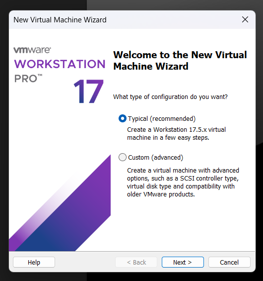
*Figure 1 — Écran d'accueil de l'assistant : je sélectionne la configuration « Typical (recommended) ».*

### 2.2 Sélection de l'image ISO

L'assistant demande la source d'installation. Je pointe vers mon dossier `_ISO`, qui contient trois images : Ubuntu 26.04, Windows 10 22H2 et Windows 11 24H2. Je retiens **Win10_22H2_French_x64** : Windows 10 est plus léger que Windows 11, il n'exige pas de TPM 2.0 et il reste très répandu dans les petites structures comme ce cabinet.

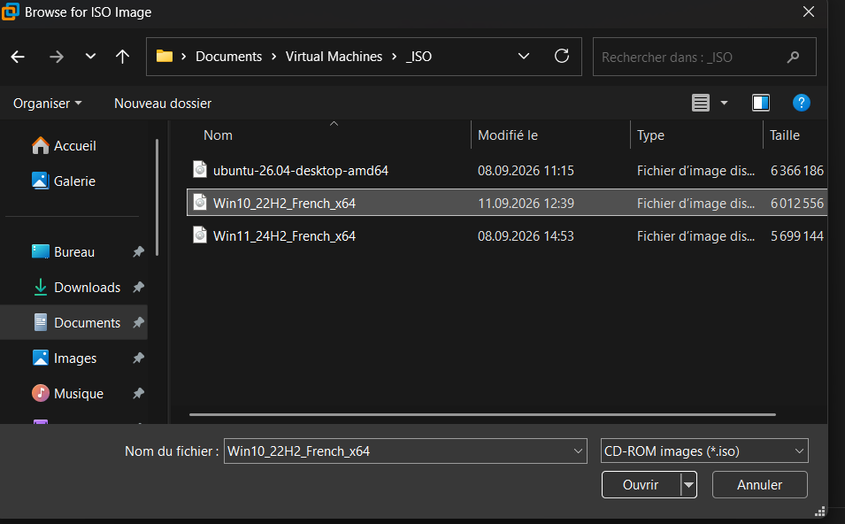
*Figure 2 — Choix du fichier ISO : Win10_22H2_French_x64 (environ 6 Go) parmi les images disponibles.*

VMware détecte automatiquement le système contenu dans l'image et affiche « Windows 10 x64 detected ». Il propose alors le mode **Easy Install**, qui automatise les premières étapes de l'installation.

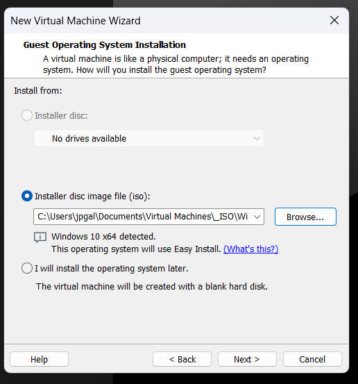
*Figure 3 — L'ISO est reconnue : VMware bascule automatiquement en mode Easy Install.*

### 2.3 Informations d'installation

Comme Easy Install est actif, VMware me demande à l'avance les informations que Windows réclamerait pendant son installation : la version à installer (Windows 10 Pro), le nom de l'utilisateur et un mot de passe. Je laisse la clé produit vide, l'installation se faisant en version d'évaluation dans un cadre pédagogique.

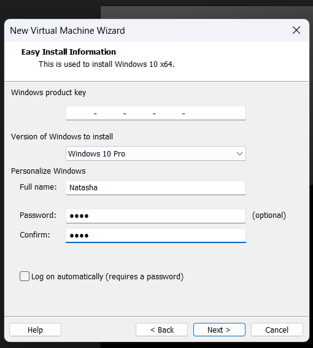
*Figure 4 — Édition Windows 10 Pro, nom complet « Natasha » et mot de passe du compte administrateur.*

### 2.4 Nom et emplacement de la machine virtuelle

Je nomme la machine virtuelle et je choisis son emplacement sur le disque de l'hôte, dans mon dossier de cours dédié au projet. Ce nom est celui qui apparaîtra dans la bibliothèque VMware ; il est indépendant du nom réseau que je donnerai plus tard à Windows.

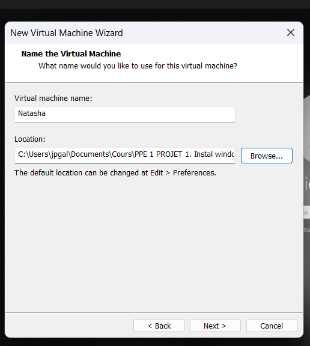
*Figure 5 — Nom de la VM et dossier de destination du projet.*

### 2.5 Réglage du matériel virtuel

Avant de valider, j'ajuste les ressources allouées. VMware recommandait 60 Go de disque : je monte à 75 Go pour avoir de la marge si je dois installer d'autres logiciels métier par la suite. J'alloue 8 Go de mémoire vive et 4 cœurs répartis sur un seul processeur, ce qui correspond à un poste bureautique correct. L'écran récapitulatif confirme aussi que la carte réseau est en **NAT**, point important pour la suite du projet.

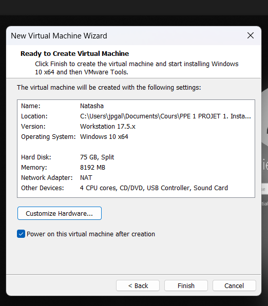
*Figure 6 — Récapitulatif avant création : 75 Go de disque, 8192 Mo de RAM, 4 cœurs, réseau NAT.*

### 2.6 Installation

Je clique sur *Finish* : la machine démarre et l'installation de Windows se lance seule. Elle enchaîne la copie des fichiers, la préparation, l'installation des fonctionnalités et des mises à jour, avec plusieurs redémarrages automatiques.

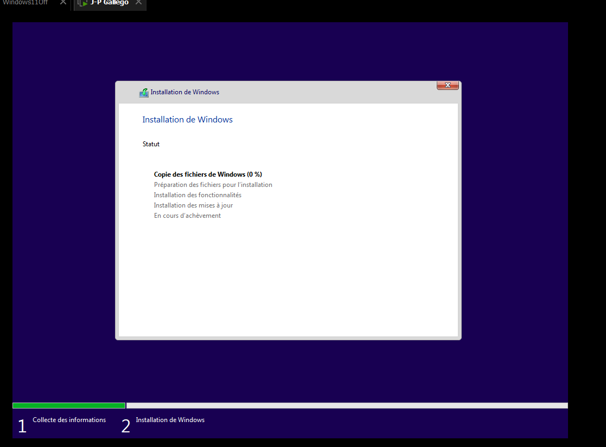
*Figure 7 — Installation en cours : copie des fichiers de Windows.*

Au bout d'une vingtaine de minutes, le bureau de Windows 10 s'affiche. Le système est fonctionnel : la première étape est terminée, il reste à le configurer pour l'utilisatrice.

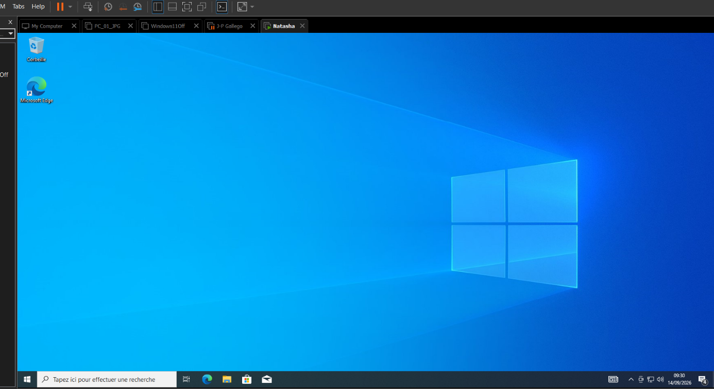
*Figure 8 — Premier démarrage : le bureau Windows 10 est opérationnel dans l'onglet « Natasha » de VMware.*

---

## 3. Paramètres régionaux, langue et clavier

L'ISO étant en français de France, le poste est configuré par défaut sur la France. Comme le cabinet et l'utilisatrice sont en Suisse, je dois corriger trois choses : le pays, le format régional (dates, monnaie, séparateurs) et surtout la disposition du clavier, qui n'est pas la même entre un clavier AZERTY français et un clavier suisse romand.

J'ouvre les Paramètres Windows, puis la rubrique **Heure et langue**.

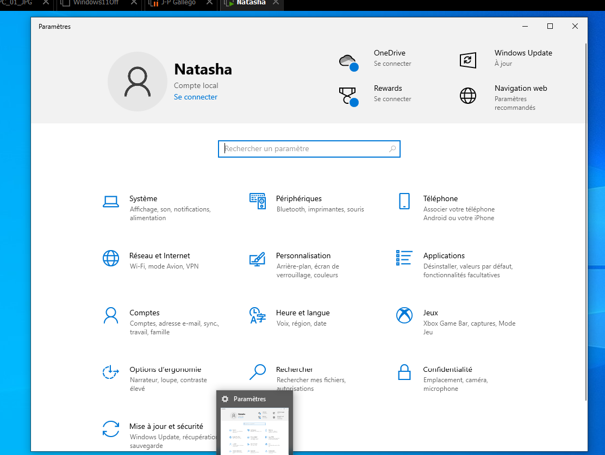
*Figure 9 — Page d'accueil des Paramètres Windows.*

Je vérifie d'abord la date et l'heure. La synchronisation automatique est active et le fuseau horaire est déjà correct : UTC+01:00 (Amsterdam, Berlin, Berne, Rome). Une horloge juste est importante — un décalage peut empêcher la connexion à certains services et fausser l'horodatage des documents comptables.

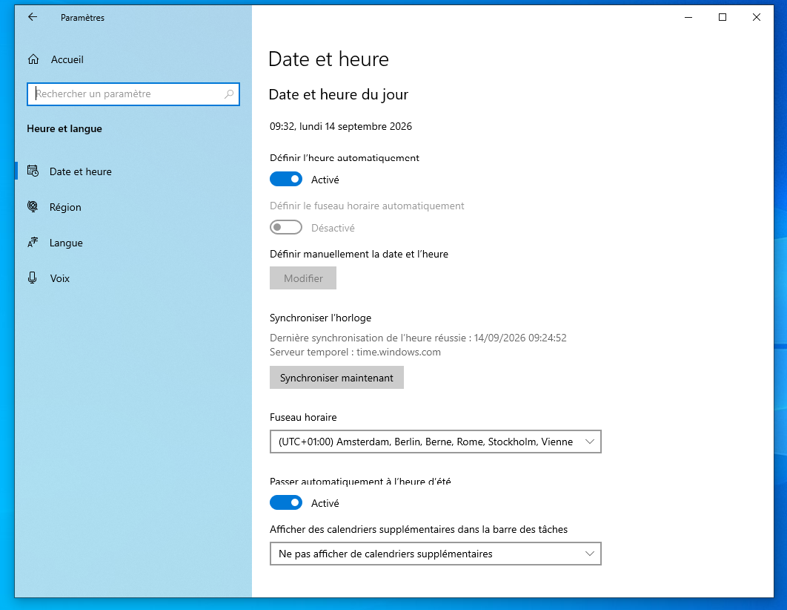
*Figure 10 — Date et heure : synchronisation automatique activée, fuseau horaire de Berne.*

Je passe ensuite à l'onglet **Région**. Le pays est encore réglé sur la France, avec un format de date `14/09/2026`.

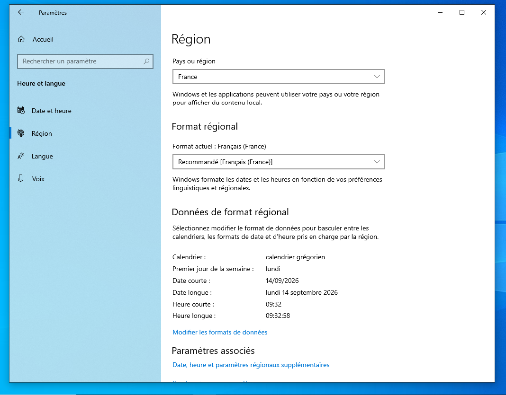
*Figure 11 — État initial : pays « France » et format « Français (France) ».*

Je bascule le pays sur **Suisse** et le format régional sur **Français (Suisse)**. Windows affiche alors un avertissement en rouge : certaines applications doivent être fermées et rouvertes pour que le changement soit pris en compte.

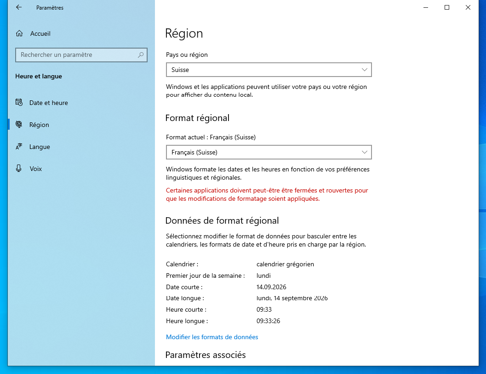
*Figure 12 — Bascule vers la Suisse ; Windows signale qu'un redémarrage des applications est nécessaire.*

Après avoir fermé puis rouvert les Paramètres, le changement est bien appliqué : la date courte s'affiche désormais au format suisse `14.09.2026` avec des points, au lieu du format français avec des barres obliques.

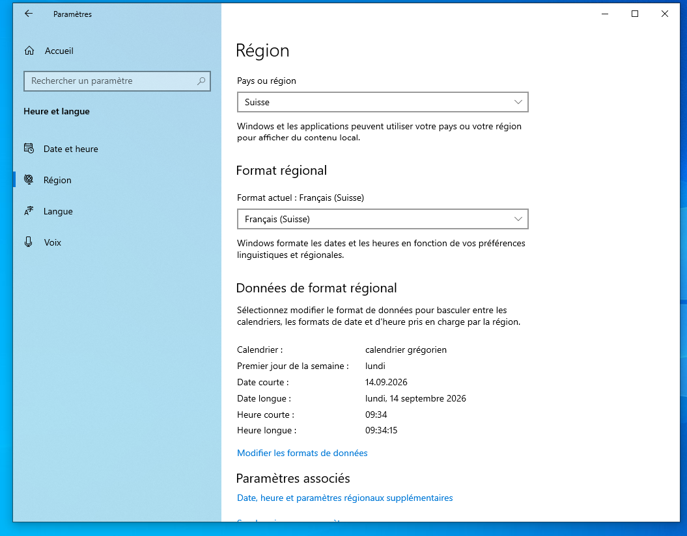
*Figure 13 — Après redémarrage de l'application : format suisse appliqué (14.09.2026).*

Enfin, dans l'onglet **Langue**, je règle l'affichage de Windows, les applications et surtout le clavier sur Français (Suisse), puisque Natasha travaille sur un clavier suisse. Sans ce réglage, les touches accentuées, le `é` ou le `ç` ne correspondraient pas aux inscriptions gravées sur ses touches.

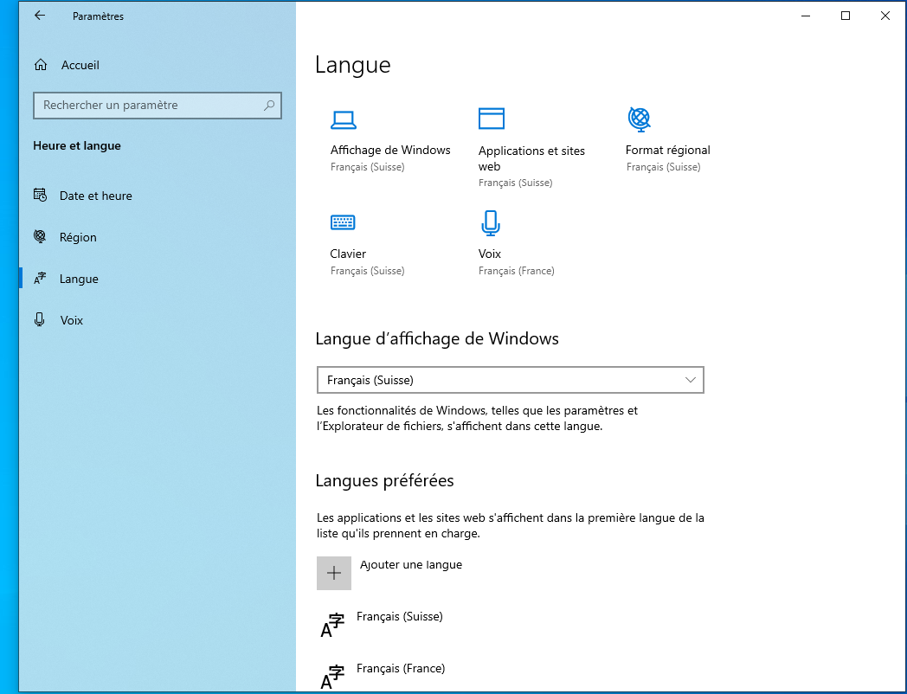
*Figure 14 — Affichage, applications, format et clavier tous en Français (Suisse).*

---

## 4. Mises à jour de Windows

Une image ISO est figée à la date de sa création : le système fraîchement installé accuse donc plusieurs mois, voire plusieurs années, de retard sur les correctifs de sécurité. C'est la première chose à traiter avant de confier le poste à une utilisatrice, d'autant qu'un cabinet comptable manipule des données sensibles.

Je vais donc dans **Paramètres > Mise à jour et sécurité > Windows Update** et je lance une recherche.

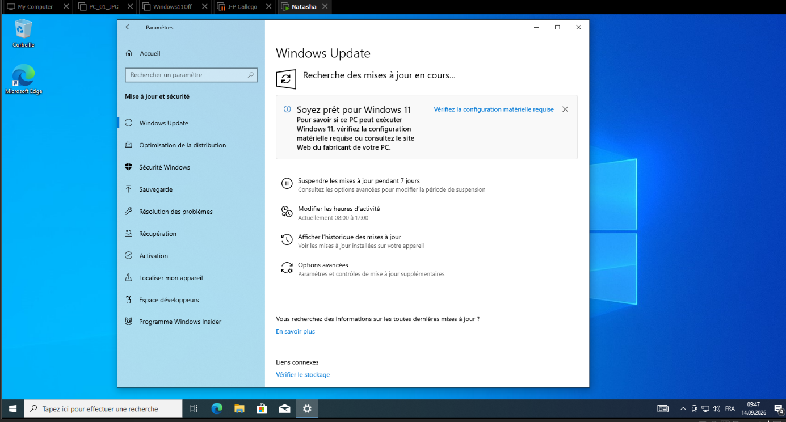
*Figure 15 — Recherche des mises à jour en cours.*

Huit mises à jour sont trouvées et téléchargées : la base de signatures de Microsoft Defender, l'outil de suppression de logiciels malveillants, plusieurs mises à jour cumulatives pour Windows 10 22H2 et les correctifs .NET Framework. Je laisse le processus aller jusqu'au bout, redémarrages compris.

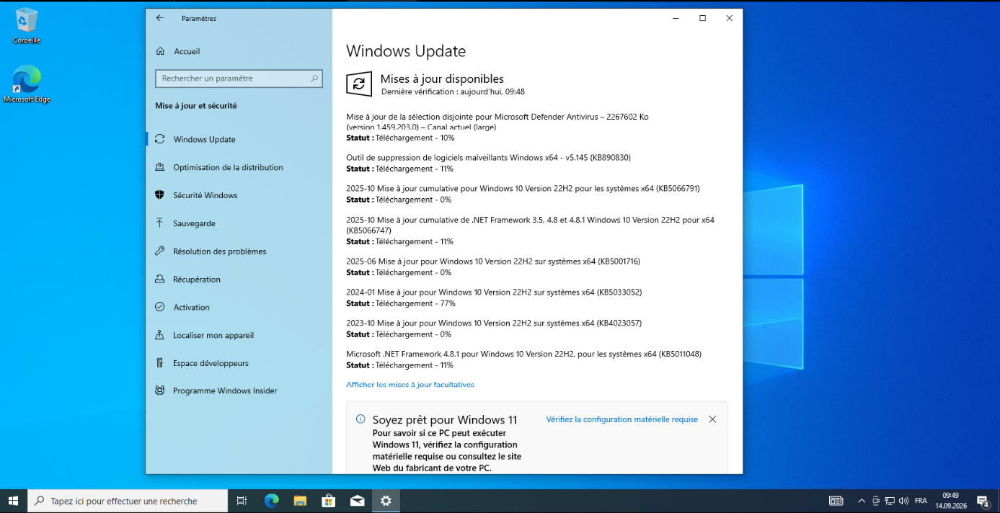
*Figure 16 — Les huit mises à jour en cours de téléchargement (Defender, cumulatives 22H2, .NET Framework).*

---

## 5. Création des comptes utilisateurs

> [!NOTE]
> **Principe du moindre privilège** — l'utilisatrice travaille au quotidien avec un compte standard, qui ne peut ni installer de logiciels ni modifier le système. Un compte administrateur distinct est conservé pour la maintenance. Si Natasha ouvre une pièce jointe vérolée, le code malveillant n'héritera pas des droits d'administration.

J'ouvre **Paramètres > Comptes**.

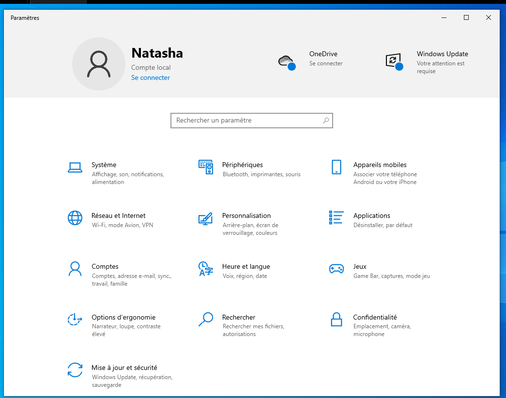
*Figure 17 — Accès à la rubrique Comptes des Paramètres.*

La page « Vos informations » confirme que le compte créé pendant l'installation est bien un compte local disposant des droits d'administrateur. C'est ce compte que je garderai pour la maintenance.

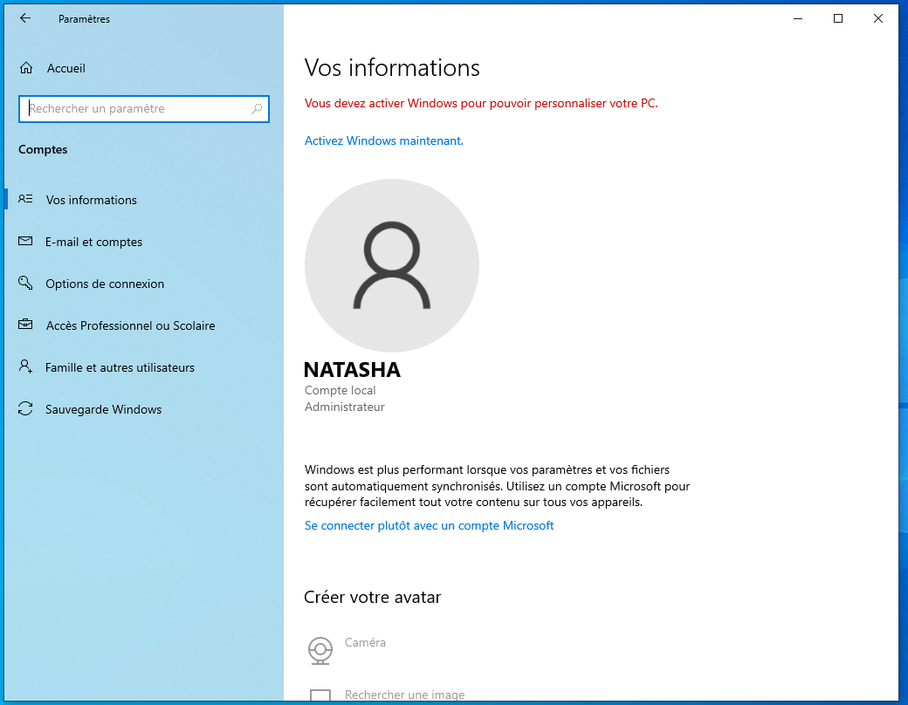
*Figure 18 — Le compte créé à l'installation est un compte local administrateur.*

Je passe dans « Famille et autres utilisateurs », puis je clique sur « Ajouter un autre utilisateur sur ce PC ».

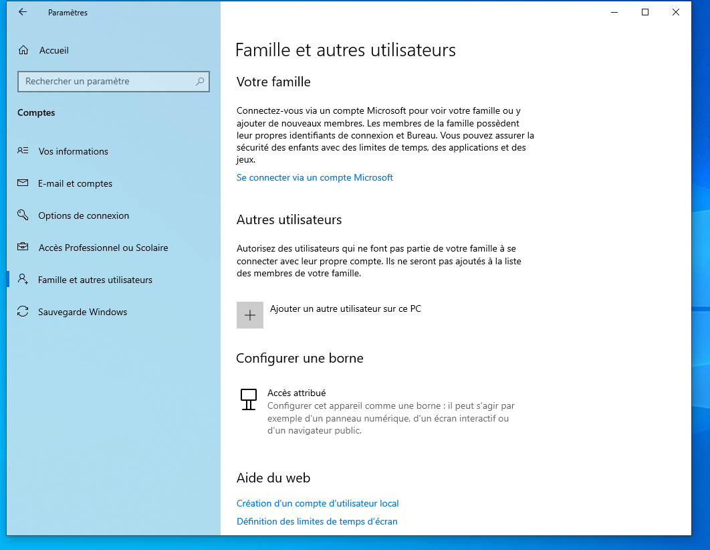
*Figure 19 — Rubrique « Famille et autres utilisateurs ».*

Windows tente de me faire créer un compte Microsoft en ligne. Je refuse en cliquant sur « Je ne dispose pas des informations de connexion de cette personne », puis sur « Ajouter un utilisateur sans compte Microsoft » : un compte local suffit pour un poste de travail en cabinet et évite de lier les données professionnelles à une adresse personnelle.

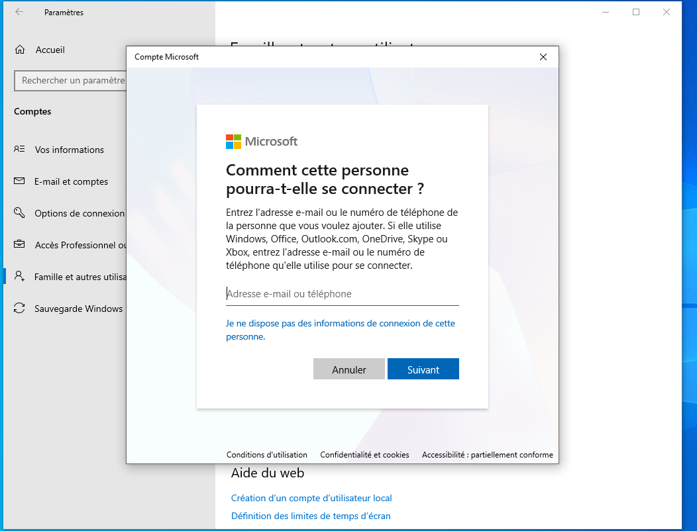
*Figure 20 — Je contourne la création d'un compte Microsoft pour créer un compte purement local.*

Je saisis le nom d'utilisateur `Natasha_01`, un mot de passe et les trois questions de récupération exigées par Windows 10 pour les comptes locaux.

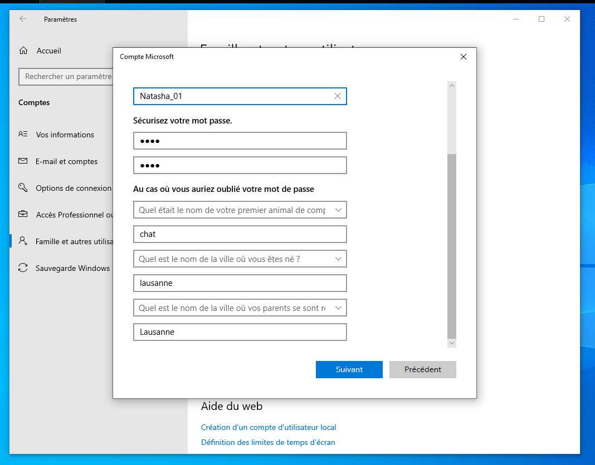
*Figure 21 — Création du compte local Natasha_01 avec ses questions de sécurité.*

Le compte apparaît ensuite dans la liste des autres utilisateurs, en « Compte local ». Je ne touche pas au bouton « Changer le type de compte » : le compte doit justement rester **standard**, et non administrateur.

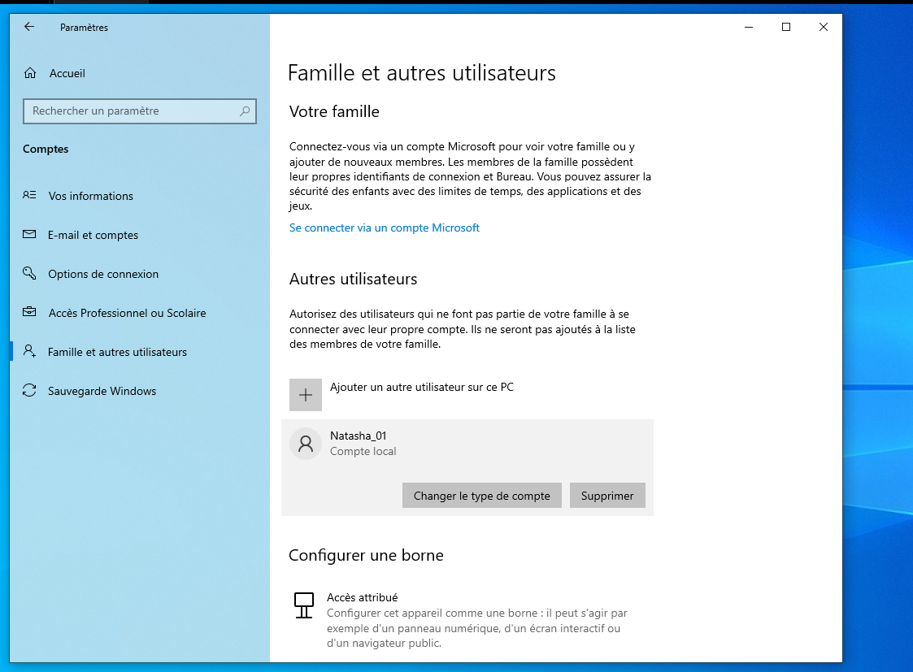
*Figure 22 — Natasha_01 est créé en tant que compte local standard.*

Un redémarrage confirme le résultat : l'écran de connexion propose bien les deux comptes, celui de l'utilisatrice et celui de l'administrateur.

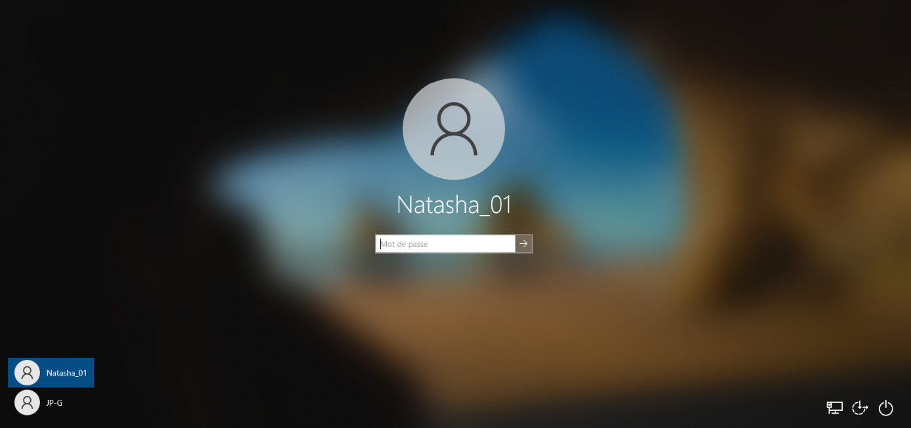
*Figure 23 — Écran de connexion : les deux comptes coexistent.*

Je protège enfin le compte administrateur par un mot de passe. Plutôt que de repasser par l'interface graphique, j'utilise PowerShell ouvert en tant qu'administrateur :

```powershell
net user <nom_du_compte> <mot_de_passe>
```


*Figure 24 — Attribution du mot de passe au compte administrateur via la commande net user (mot de passe masqué pour la version publique).*

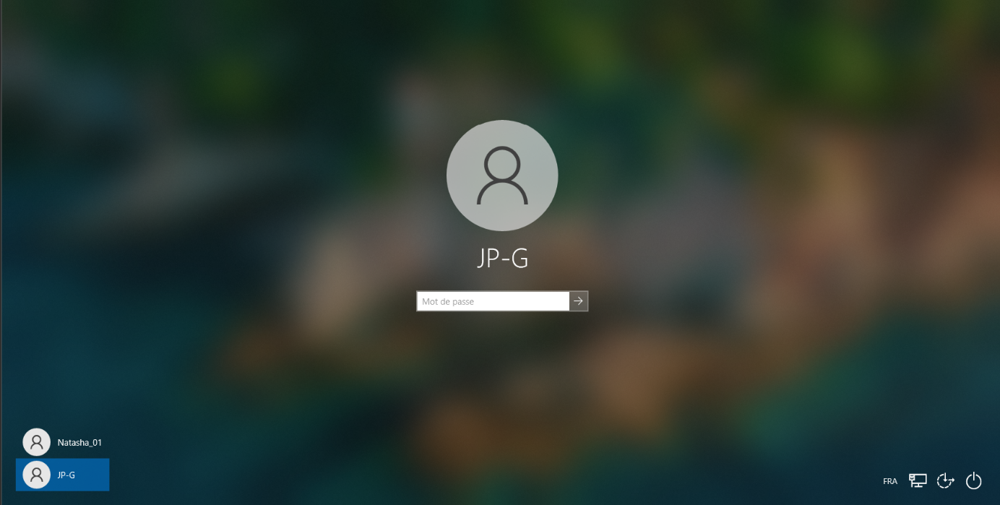
*Figure 25 — Le compte administrateur demande désormais un mot de passe à la connexion.*

> [!IMPORTANT]
> **Point à corriger** — les mots de passe utilisés ici ne sont formés que de quatre chiffres identiques. La consigne demandait une politique de sécurité simple : il faut au minimum 8 caractères, mélangeant majuscules, minuscules, chiffres et caractères spéciaux (par exemple `Cabinet-2026!`). Voir la section 12.

---

## 6. Installation des logiciels métier

Trois logiciels sont demandés : un navigateur, un lecteur PDF et une suite bureautique. Ce sont les trois outils dont un comptable se sert tous les jours — accès aux portails fiscaux en ligne, lecture de factures et de relevés, production de tableaux et de courriers.

### 6.1 Navigateur — Mozilla Firefox

J'ouvre Microsoft Edge, seul navigateur présent sur une installation neuve, et je recherche Firefox.

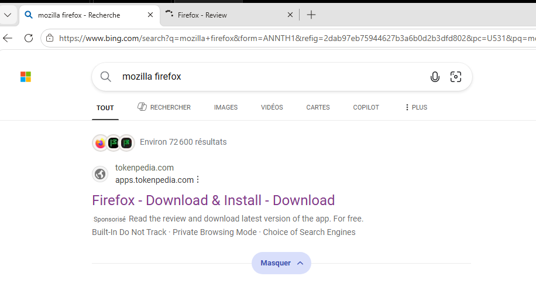
*Figure 26 — Résultats de recherche pour Firefox.*

> [!WARNING]
> **Attention** — le premier résultat affiché est un lien sponsorisé qui ne pointe pas vers le site officiel de Mozilla mais vers un site tiers. Ce type de lien est un vecteur classique de logiciels indésirables. Un logiciel doit toujours être téléchargé depuis le site de son éditeur — ici `mozilla.org` — en vérifiant l'adresse dans la barre du navigateur avant de cliquer.

Une fois sur le site officiel, je télécharge et je lance l'installateur.

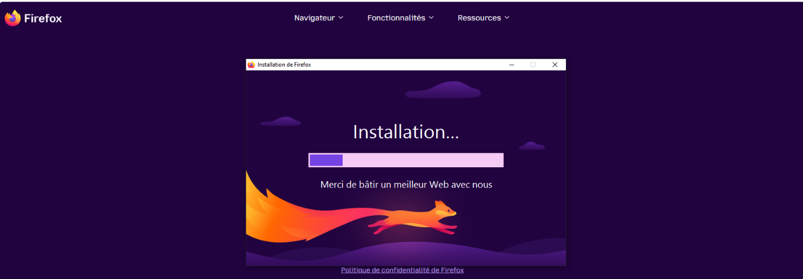
*Figure 27 — Installation de Firefox depuis le site de l'éditeur.*

Au premier lancement, Firefox propose de devenir le navigateur principal : j'accepte, conformément à la demande.

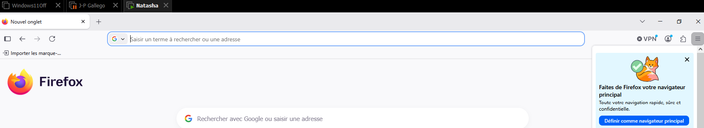
*Figure 28 — Firefox est défini comme navigateur par défaut du poste.*

### 6.2 Lecteur PDF — PDFgear

Je télécharge ensuite PDFgear, un lecteur PDF gratuit qui permet aussi d'annoter et de fusionner des documents — pratique pour regrouper des justificatifs comptables.

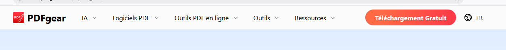
*Figure 29 — Site officiel de PDFgear, bouton de téléchargement.*

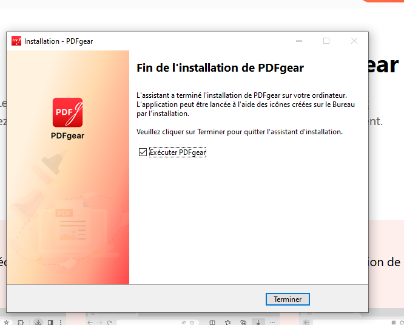
*Figure 30 — Fin de l'installation de PDFgear.*

### 6.3 Suite bureautique — Microsoft 365

Enfin, j'installe la suite bureautique Microsoft 365 depuis le site de Microsoft. Word et Excel sont indispensables dans un cabinet comptable, Excel en particulier pour les tableaux de charges et les rapprochements.

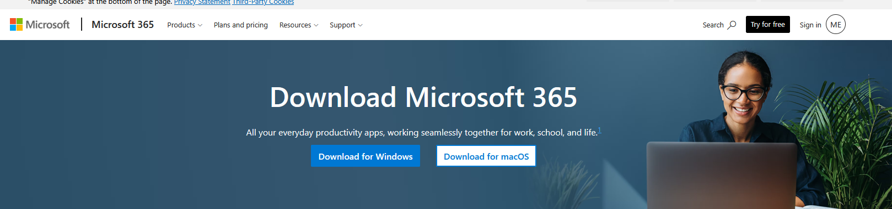
*Figure 31 — Page de téléchargement officielle de Microsoft 365.*

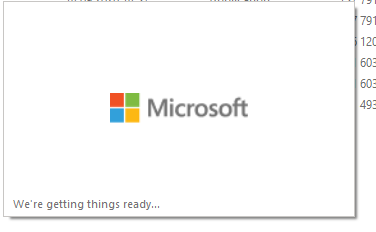
*Figure 32 — Préparation de l'installation de la suite Office.*

---

## 7. Configuration réseau : adresse IP fixe

Par défaut, la machine reçoit son adresse automatiquement par DHCP. Pour un poste qui doit être joignable de façon stable — notamment pour le partage d'imprimante et de dossiers — une adresse fixe est préférable : elle ne change pas au redémarrage.

Je clique droit sur l'icône réseau de la barre des tâches, puis sur « Ouvrir les paramètres réseau et Internet ».

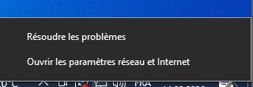
*Figure 33 — Menu contextuel de l'icône réseau.*

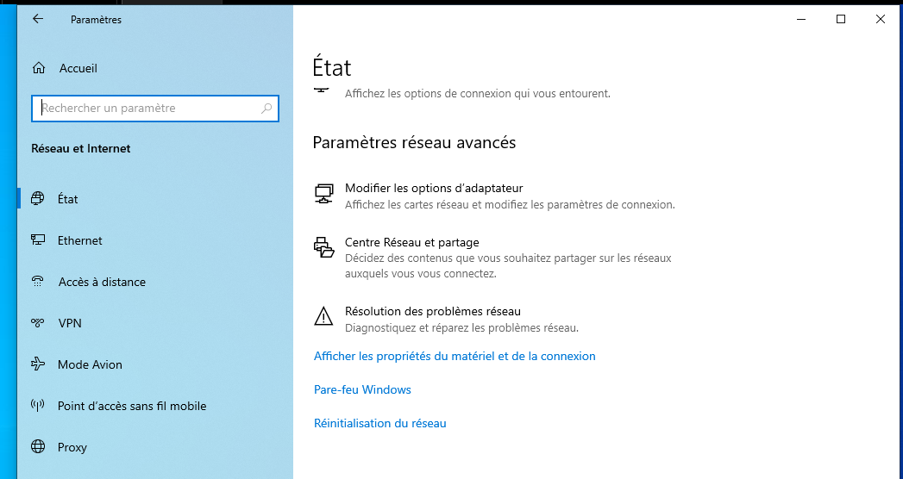
*Figure 34 — État du réseau ; je clique sur « Modifier les options d'adaptateur ».*

La fenêtre des connexions réseau s'ouvre. Je fais un clic droit sur la carte **Ethernet0**, puis *Propriétés*.

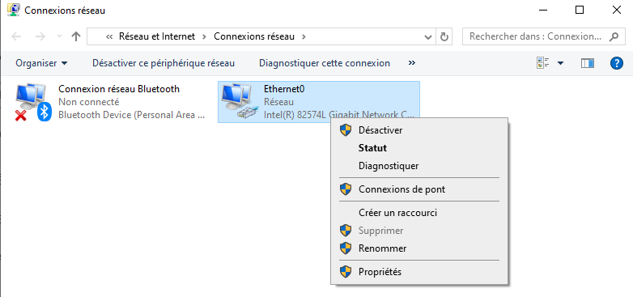
*Figure 35 — Clic droit sur la carte Ethernet0 > Propriétés.*

Dans la liste des protocoles, je sélectionne **Protocole Internet version 4 (TCP/IPv4)** et je clique de nouveau sur *Propriétés*.

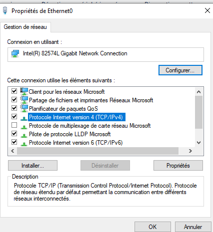
*Figure 36 — Sélection du protocole TCP/IPv4.*

### 7.1 Déterminer les bons paramètres

Avant de saisir une adresse au hasard, il faut savoir dans quel sous-réseau se trouve la machine virtuelle. J'ouvre donc une invite de commande sur la **machine hôte** (physique) et j'exécute :

```cmd
ipconfig /all
```

Cette commande révèle les deux réseaux virtuels créés par VMware sur l'hôte :

- **VMware Network Adapter VMnet1 (Host-only)** : réseau `192.168.75.x`
- **VMware Network Adapter VMnet8 (NAT)** : réseau `192.168.132.x`

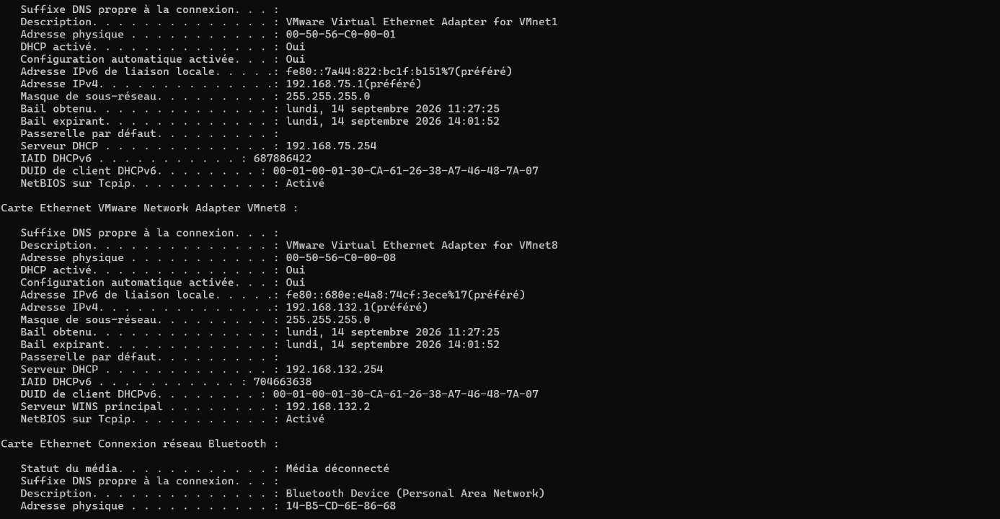
*Figure 37 — Résultat de ipconfig /all sur l'hôte : les deux adaptateurs virtuels VMnet1 et VMnet8.*

J'ai vérifié dans VMware Workstation (*VM > Paramètres > Adaptateur réseau*) que ma machine virtuelle était en mode **NAT**. C'est donc le sous-réseau `192.168.132.x` qu'il faut utiliser, celui de VMnet8.

### 7.2 Saisie de la configuration

Je coche « Utiliser l'adresse IP suivante » et je renseigne :

| Paramètre | Valeur | Justification |
| --- | --- | --- |
| Adresse IP | `192.168.132.106` | Adresse libre du sous-réseau NAT ; j'évite `.1` (passerelle), `.2` (DNS) et `.254` (DHCP) |
| Masque de sous-réseau | `255.255.255.0` | Masque standard /24 : 254 adresses possibles sur le réseau |
| Passerelle par défaut | `192.168.132.1` | Adresse de l'adaptateur VMnet8 sur l'hôte, qui sert de passerelle vers Internet |
| Serveur DNS préféré | `192.168.132.2` *(à ajouter)* | Serveur DNS de VMware ; sans lui, aucun nom de site ne sera résolu |

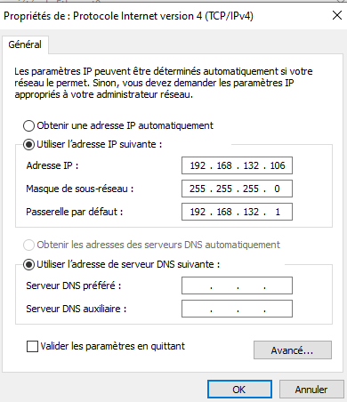
*Figure 38 — Configuration IPv4 manuelle appliquée à la carte Ethernet0.*

> [!IMPORTANT]
> **Point à corriger** — sur la capture, les champs DNS sont restés vides. Tant que le poste était en DHCP, il recevait un DNS automatiquement ; en adresse fixe, il n'en a plus. Résultat : les adresses IP répondent encore au ping mais aucun site web ne s'ouvre. Il faut saisir `192.168.132.2` en DNS préféré (et éventuellement `8.8.8.8` en auxiliaire).

---

## 8. Nom de la machine et groupe de travail

Un poste installé reçoit un nom aléatoire du type `DESKTOP-4F7K2QA`, illisible dans un parc informatique. Je le renomme en `PC_Cabinet_01`, nom explicite qui permettra plus tard d'identifier immédiatement la machine sur le réseau du cabinet.

J'ouvre PowerShell **en tant qu'administrateur** et je saisis :

```powershell
Rename-Computer -NewName "PC_Cabinet_01" -Restart
```

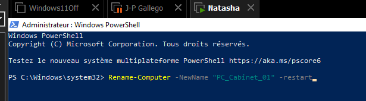
*Figure 39 — Renommage de la machine en PowerShell administrateur.*

Le paramètre `-Restart` redémarre automatiquement le poste, le changement de nom n'étant effectif qu'après redémarrage.

Je rattache ensuite la machine au groupe de travail du cabinet, toujours depuis PowerShell en administrateur :

```powershell
Add-Computer -WorkgroupName "Cabinet-Compt" -Restart
```

Un groupe de travail réunit des postes de même niveau, sans serveur central : c'est la solution adaptée à une structure de trois personnes. Les trois postes doivent porter le même nom de groupe pour se voir et partager fichiers et imprimante.

---

## 9. Ajout de l'imprimante et test d'impression

Je me rends dans **Paramètres > Périphériques > Imprimantes et scanners**, puis « Ajouter une imprimante ou un scanner ».

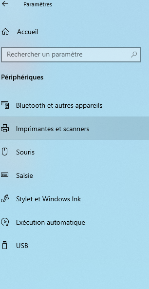
*Figure 40 — Rubrique « Imprimantes et scanners » des Paramètres.*

Aucune imprimante n'est détectée automatiquement — normal, la machine virtuelle est isolée derrière le NAT. Je clique sur « L'imprimante que je veux n'est pas répertoriée », puis je choisis l'ajout avec des paramètres manuels.

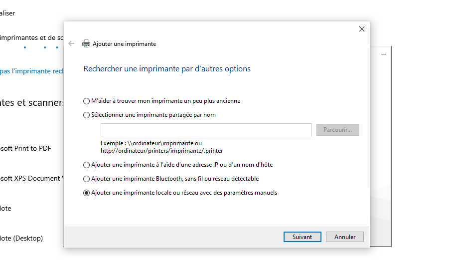
*Figure 41 — « Ajouter une imprimante locale ou réseau avec des paramètres manuels ».*

Je choisis ensuite le port. Sur un réseau réel, on créerait ici un **port TCP/IP standard** pointant vers l'adresse de l'imprimante partagée. Faute d'imprimante physique dans cet environnement de test, je conserve un port existant pour pouvoir aller au bout de la procédure.

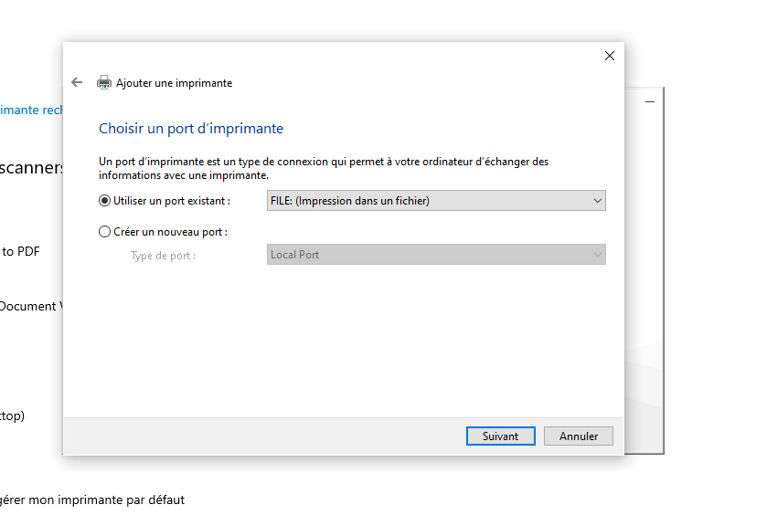
*Figure 42 — Sélection du port d'imprimante.*

Je nomme l'imprimante `Imprimante-compta`, nom clair pour les utilisateurs du cabinet, et je poursuis l'assistant jusqu'à la fin.

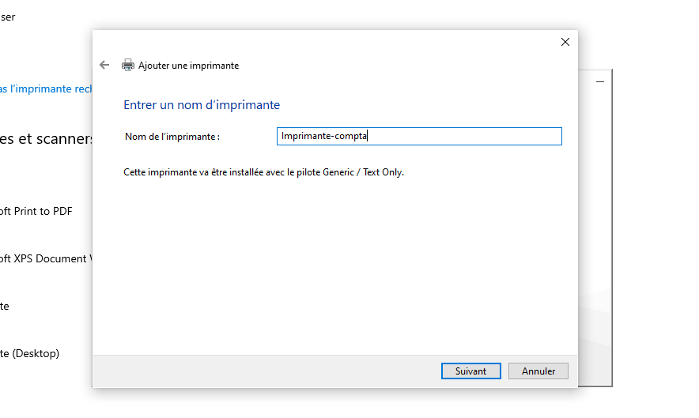
*Figure 43 — Nom attribué à l'imprimante : Imprimante-compta.*

L'imprimante apparaît désormais dans la liste des périphériques d'impression du poste.

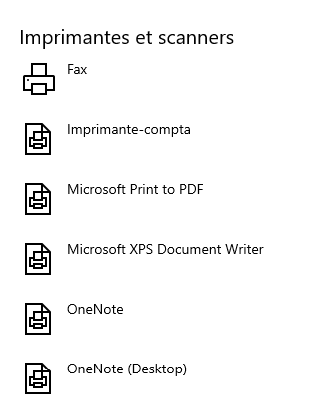
*Figure 44 — Imprimante-compta installée et visible dans la liste.*

Je termine par un test : j'ouvre une page web dans Firefox et je lance une impression. La boîte de dialogue propose bien `Imprimante-compta` comme destination, ce qui confirme que l'imprimante est reconnue par les applications et correctement installée.

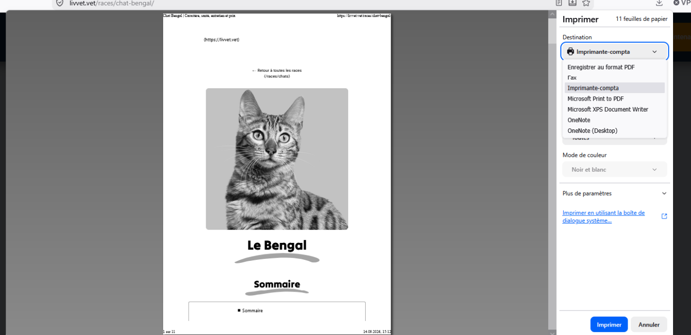
*Figure 45 — Test d'impression : Imprimante-compta est bien proposée comme destination.*

---

## 10. Sécurisation du poste

### 10.1 Antivirus

Je vérifie l'état de la **Sécurité Windows**. Les cinq zones de protection sont actives et affichent « Aucune action requise » : protection contre les virus et menaces, protection du compte, pare-feu et protection réseau, contrôle des applications et du navigateur, sécurité de l'appareil. Microsoft Defender étant intégré à Windows 10 et à jour, aucun antivirus tiers n'est nécessaire — en installer un second créerait même des conflits.

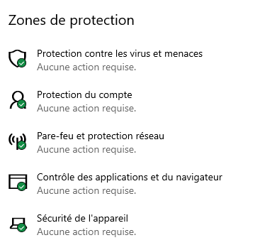
*Figure 46 — Les cinq zones de protection de Sécurité Windows sont au vert.*

### 10.2 Pare-feu

Je recherche ensuite « pare-feu » depuis la barre de recherche Windows pour ouvrir le **Pare-feu Windows Defender**.

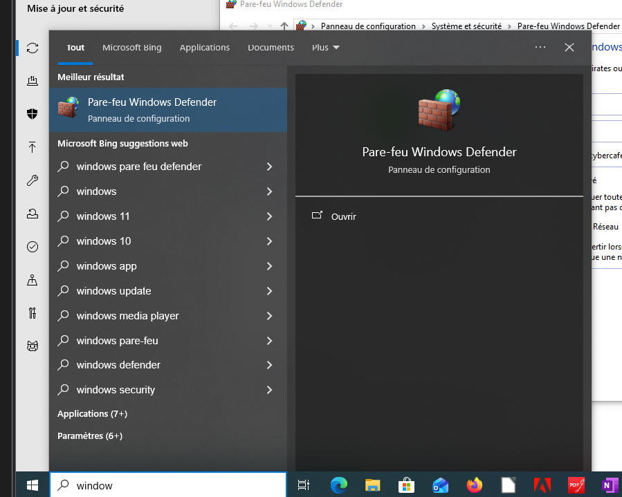
*Figure 47 — Accès au Pare-feu Windows Defender par la recherche.*

Le pare-feu est activé sur les deux profils. Les connexions entrantes sont bloquées par défaut pour toute application ne figurant pas dans la liste des applications autorisées, et une notification est affichée lorsqu'un programme est bloqué. C'est exactement le comportement attendu sur un poste de travail.

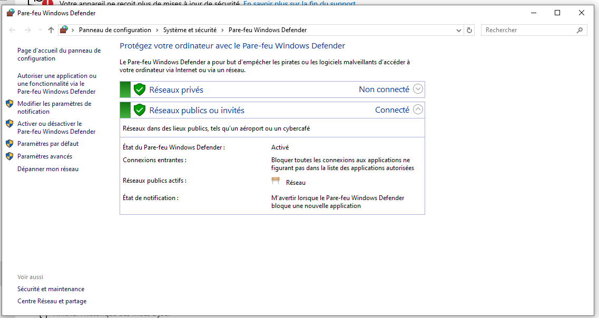
*Figure 48 — Pare-feu activé, connexions entrantes bloquées par défaut.*

---

## 11. Fiche de mise en service

> Cette fiche résume l'état final du poste au moment de la livraison. Elle est destinée à être conservée par le cabinet et consultée en cas d'intervention ultérieure.

### Identification du poste

| Rubrique | Valeur |
| --- | --- |
| Nom réseau | `PC_Cabinet_01` |
| Groupe de travail | `Cabinet-Compt` |
| Système d'exploitation | Windows 10 Pro 22H2, français, 64 bits |
| Utilisatrice | Natasha — compte standard `Natasha_01` |
| Compte de maintenance | Compte local administrateur, protégé par mot de passe |
| Date de mise en service | 14 septembre 2026 |
| Intervenant | Jean-Pierre Gallego, classe E1A |

### Matériel (machine virtuelle)

| Ressource | Allocation |
| --- | --- |
| Processeur | 1 processeur, 4 cœurs |
| Mémoire vive | 8 Go |
| Disque dur | 75 Go, fichier fractionné |
| Carte réseau | Intel 82574L Gigabit, mode NAT (VMnet8) |
| Plateforme | VMware Workstation Pro 17.5 |

### Configuration réseau

| Paramètre | Valeur |
| --- | --- |
| Mode d'attribution | Adresse IP fixe (manuelle) |
| Adresse IP | `192.168.132.106` |
| Masque de sous-réseau | `255.255.255.0` |
| Passerelle par défaut | `192.168.132.1` |
| Serveur DNS | `192.168.132.2` — à renseigner (champ actuellement vide) |

### Logiciels installés

| Logiciel | Rôle | État |
| --- | --- | --- |
| Mozilla Firefox | Navigateur web | Installé et défini par défaut |
| PDFgear | Lecture et annotation de PDF | Installé |
| Microsoft 365 | Suite bureautique (Word, Excel…) | Installé |
| Microsoft Defender | Antivirus intégré | Actif, signatures à jour |
| Pare-feu Windows Defender | Filtrage réseau | Actif sur tous les profils |

### Personnalisation utilisatrice

| Élément | Réglage |
| --- | --- |
| Pays / région | Suisse |
| Format régional | Français (Suisse) — dates au format `14.09.2026` |
| Langue d'affichage | Français (Suisse) |
| Clavier | Français (Suisse) |
| Fuseau horaire | UTC+01:00 Berne, synchronisation automatique |
| Imprimante | `Imprimante-compta`, test d'impression effectué |

### Contrôles effectués avant livraison

- [x] Windows installé et démarrant correctement
- [x] Huit mises à jour de sécurité téléchargées et appliquées
- [x] Les deux comptes apparaissent à l'écran de connexion et demandent un mot de passe
- [x] Le compte de l'utilisatrice est bien un compte standard, sans droits d'administration
- [x] Les trois logiciels métier se lancent sans erreur
- [x] Adresse IP fixe appliquée sur la carte Ethernet0
- [x] Nom de machine et groupe de travail modifiés, redémarrage effectué
- [x] `Imprimante-compta` visible et proposée dans la boîte de dialogue d'impression
- [x] Antivirus et pare-feu actifs, aucune alerte

---

## 12. Bilan et points d'amélioration

Les huit tâches demandées ont été réalisées : le poste démarre, il est à jour, configuré pour une utilisatrice suisse, équipé de ses logiciels métier, joignable à une adresse fixe, rattaché au groupe de travail du cabinet, relié à une imprimante et protégé par un antivirus et un pare-feu actifs.

En relisant mon travail, j'identifie trois points à corriger avant une véritable mise en production :

| Point | Constat | Correction à apporter |
| --- | --- | --- |
| **Mots de passe** | Mots de passe à quatre chiffres identiques, devinables immédiatement | Appliquer une politique minimale : 8 caractères, majuscules, minuscules, chiffres et caractère spécial. Commande : `net accounts /minpwlen:8` |
| **Serveur DNS** | Champs DNS laissés vides après le passage en IP fixe | Renseigner `192.168.132.2` en DNS préféré, `8.8.8.8` en auxiliaire, puis tester avec `ping google.com` |
| **Téléchargements** | Recherche de Firefox partie d'un lien sponsorisé vers un site tiers | Toujours taper directement l'adresse de l'éditeur (`mozilla.org`) et vérifier l'URL avant de télécharger |

### Ce que ce projet m'a appris

Au-delà des manipulations, ce projet m'a fait comprendre qu'une mise en service ne consiste pas seulement à installer un système : il faut aussi penser à la personne qui utilisera le poste. Le choix du clavier suisse, le nom explicite de l'imprimante ou la séparation entre compte standard et compte administrateur sont des décisions qui prennent quelques secondes à l'installation mais qui évitent des problèmes quotidiens ensuite.

J'ai aussi retenu l'importance de vérifier avant d'agir : chercher le sous-réseau avec `ipconfig /all` plutôt que d'inventer une adresse IP, ou contrôler la source d'un téléchargement avant de l'exécuter. En informatique, une minute de vérification évite souvent une heure de dépannage.

---

## 13. Glossaire

| Terme | Définition |
| --- | --- |
| **Machine virtuelle (VM)** | Ordinateur simulé par un logiciel à l'intérieur d'un ordinateur réel. Il possède son propre disque, sa propre mémoire et son propre système d'exploitation. |
| **Hôte** | La machine physique réelle, qui héberge la ou les machines virtuelles. |
| **Image ISO** | Fichier unique contenant la copie exacte d'un disque d'installation. Il remplace le DVD d'installation d'autrefois. |
| **Adresse IP** | Numéro d'identification d'une machine sur un réseau, comparable à une adresse postale. |
| **Masque de sous-réseau** | Indique quelle partie de l'adresse IP désigne le réseau et quelle partie désigne la machine. `255.255.255.0` autorise 254 machines. |
| **Passerelle** | Machine par laquelle transite le trafic destiné à l'extérieur du réseau local, typiquement vers Internet. |
| **DNS** | Annuaire qui traduit un nom de site (exemple.ch) en adresse IP. Sans DNS, il faudrait connaître les adresses IP par cœur. |
| **DHCP** | Service qui distribue automatiquement les adresses IP aux machines qui se connectent. L'inverse d'une adresse fixe. |
| **NAT** | Mode réseau où la machine virtuelle partage la connexion Internet de l'hôte tout en restant dans un sous-réseau séparé. |
| **Groupe de travail** | Ensemble de postes de même niveau qui se partagent fichiers et imprimantes, sans serveur central. |
| **Compte standard** | Compte utilisateur sans droit d'installation ni de modification du système. C'est le compte de travail quotidien. |
| **Compte administrateur** | Compte disposant de tous les droits sur la machine. Réservé à la maintenance. |
| **Pare-feu** | Filtre qui contrôle les connexions entrant et sortant de la machine, et bloque celles qui ne sont pas autorisées. |
| **PowerShell** | Interpréteur de commandes de Windows, qui permet d'administrer le système en tapant des instructions. |
---

<sub>Projet réalisé dans le cadre de ma formation CFC informaticien au Geneva Institute of Technology.</sub>

**[⬅ Retour à tous les projets](../README.md)** · [Mon profil](https://jp-gallego.github.io) · [LinkedIn](https://www.linkedin.com/in/jean-pierre-gallego-santillan-6b4701433)
