# Projet 4 — Dépannage d'un poste : carte réseau hors service

> **Jean-Pierre Gallego Santillan** · Apprenti informaticien CFC · IT Essentials ICT-187 · Classe E1A · Septembre 2026

Le scénario : un utilisateur a voulu installer lui-même un pilote pour sa carte réseau, mais il a pris le mauvais. Résultat, plus d'Internet. J'ai d'abord reproduit la panne sur ma VM, puis je l'ai diagnostiquée et réparée comme si j'étais au support, et j'ai écrit le rapport d'intervention (symptôme, hypothèses, diagnostic, solution, recommandations).

## Sommaire

- [1. Présentation du projet](#1-présentation-du-projet)
- [2. Reproduction de la panne](#2-reproduction-de-la-panne)
- [3. Symptôme constaté](#3-symptôme-constaté)
- [4. Diagnostic](#4-diagnostic)
- [5. Résolution](#5-résolution)
- [6. Vérification du bon fonctionnement](#6-vérification-du-bon-fonctionnement)
- [7. Recommandations](#7-recommandations)
- [8. Conclusion](#8-conclusion)
- [Annexe — Outils et raccourcis utilisés](#annexe--outils-et-raccourcis-utilisés)

---

## 1. Présentation du projet

### 1.1 Contexte

Le service support d'une entreprise reçoit un poste signalé en panne par un utilisateur. La mission consiste à diagnostiquer le problème avec les outils du système d'exploitation, à le résoudre, puis à rédiger un rapport d'intervention compréhensible par un tiers.

**Scénario choisi.** Un client a voulu installer lui-même un pilote pour sa carte réseau, mais il a sélectionné un pilote qui ne correspond pas à son matériel. Résultat : la carte réseau ne fonctionne plus et le poste n'a plus accès à Internet.

Pour pouvoir documenter la panne de A à Z, je l'ai d'abord **reproduite volontairement** sur un poste de test (chapitre 2), puis je l'ai diagnostiquée et réparée comme le ferait un technicien (chapitres 3 à 6).

### 1.2 Environnement de travail

| Élément | Valeur |
| --- | --- |
| Hyperviseur | VMware Workstation Pro 17 |
| Poste de test | Machine virtuelle des projets précédents, nom d'hôte DESKTOP-FAM46F5 |
| Système | Windows 10 Pro 64 bits, version 22H2 |
| Matériel concerné | Carte réseau Ethernet Intel(R) 82574L Gigabit Network Connection |
| Outils utilisés | Recherche Windows, fenêtre Exécuter (Windows + R), Gestionnaire de périphériques (devmgmt.msc), zone de notification de la barre des tâches |
| Date de l'intervention | 17.09.2026 |

### 1.3 Fiche d'intervention (résumé du ticket)

| Rubrique | Contenu |
| --- | --- |
| Symptôme | Plus d'accès au réseau ni à Internet ; icône réseau barrée dans la barre des tâches |
| Diagnostic | Pilote incompatible installé sur la carte Intel 82574L (pilote d'une carte Wi-Fi Lenovo) ; le périphérique ne peut pas démarrer (code 10) |
| Actions | Mise à jour du pilote via le Gestionnaire de périphériques avec la recherche automatique de Windows |
| Résolution | Pilote Intel d'origine réinstallé, triangle d'avertissement disparu, connexion réseau rétablie |
| Statut | Résolu ✔ |

## 2. Reproduction de la panne

Cette partie montre comment la panne a été créée. Elle permet de comprendre exactement ce que l'utilisateur a fait et donc de savoir quoi chercher lors du diagnostic.

### 2.1 Ouvrir le Gestionnaire de périphériques

Dans la barre de recherche de Windows, je tape **gestion**. Le meilleur résultat proposé est **Gestionnaire de périphériques** (Panneau de configuration). Je clique sur **Ouvrir**.

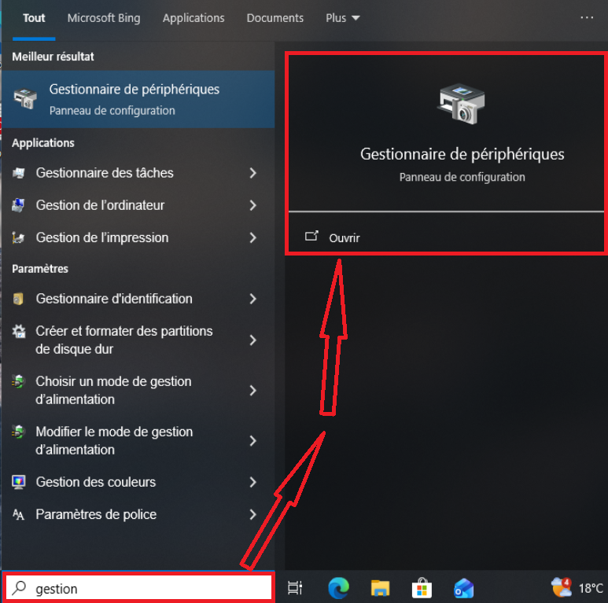

*Figure 1 — Recherche Windows : le mot « gestion » fait apparaître le Gestionnaire de périphériques, qu'on ouvre avec le bouton « Ouvrir ».*

Le Gestionnaire de périphériques affiche tout le matériel du poste, classé par catégories (Batteries, Bluetooth, Cartes graphiques, Claviers…). La catégorie qui m'intéresse est **Cartes réseau** : je clique sur la petite flèche à sa gauche pour la déplier.

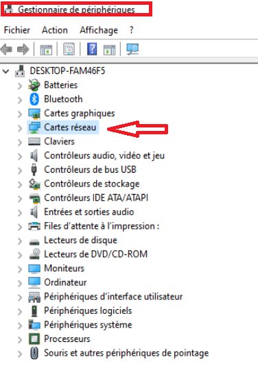

*Figure 2 — Liste des catégories de matériel du poste DESKTOP-FAM46F5 ; la catégorie « Cartes réseau » est celle qui gère la connexion.*

La catégorie s'ouvre et affiche toutes les cartes réseau. Les lignes **WAN Miniport** et **Bluetooth Device** sont des cartes virtuelles créées par Windows ; la vraie carte physique (virtuelle ici, émulée par VMware) est l'**Intel(R) 82574L Gigabit Network Connection**. C'est elle qui assure la connexion Ethernet.

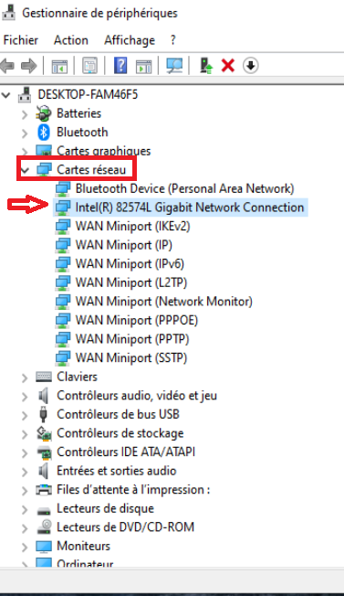

*Figure 3 — Contenu de « Cartes réseau » : la carte Intel(R) 82574L Gigabit Network Connection est la carte qui relie le poste au réseau.*

### 2.2 Installer volontairement un mauvais pilote

Je double-clique sur la carte Intel. La fenêtre **Propriétés** s'ouvre ; dans l'onglet **Pilote**, on voit les informations du pilote actuel : fournisseur **Microsoft**, date **12.06.2018**, version **12.17.10.8**, signé par Microsoft Windows. Je clique sur **Mettre à jour le pilote**.

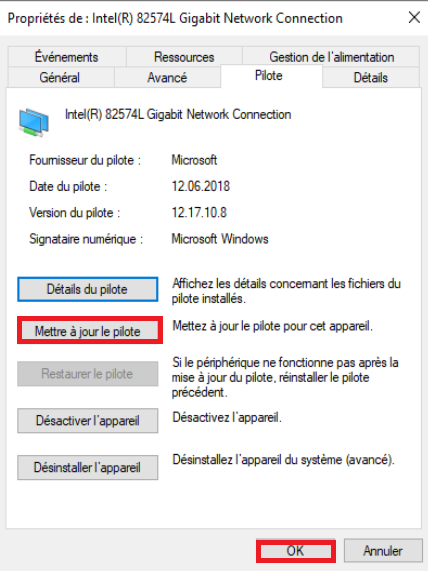

*Figure 4 — Onglet « Pilote » des propriétés de la carte Intel : informations du pilote fonctionnel et bouton « Mettre à jour le pilote ».*

Windows demande comment rechercher le pilote. Je choisis **Parcourir mon poste de travail** puis, sur l'écran suivant, **Choisir parmi une liste de pilotes disponibles sur mon ordinateur**. Cette option permet de choisir soi-même le pilote, au lieu de laisser Windows trouver le bon.

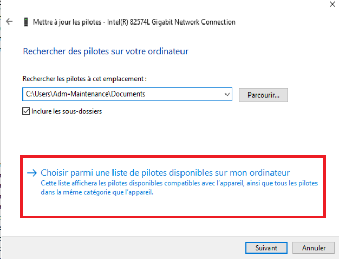

*Figure 5 — Choix de l'option « Choisir parmi une liste de pilotes disponibles sur mon ordinateur », qui permet de sélectionner le pilote manuellement.*

Par défaut, la case **Afficher les matériels compatibles** est cochée : Windows ne propose alors que les pilotes adaptés à la carte, ici un seul modèle, l'Intel(R) 82574L. Pour provoquer la panne, je **décoche** cette case.

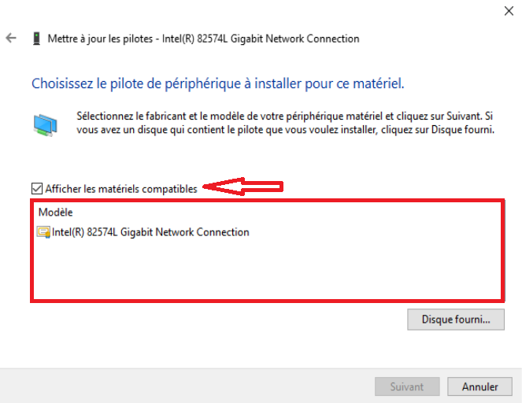

*Figure 6 — Case « Afficher les matériels compatibles » cochée : seul le pilote compatible Intel(R) 82574L est proposé.*

Une fois la case décochée, Windows affiche **tous** les pilotes réseau qu'il connaît, classés par fabricant (IBM, Intel, Intel Corporation…) puis par modèle. La plupart ne correspondent pas du tout au matériel installé.

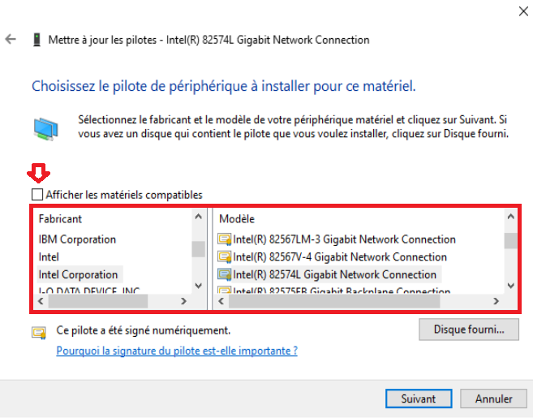

*Figure 7 — Case décochée : la liste complète des fabricants et des modèles apparaît, y compris des pilotes incompatibles avec la carte.*

Je sélectionne volontairement un pilote sans rapport avec la carte : fabricant **Lenovo Corp.**, modèle **Carte PCI Express réseau local sans fil 1x1 11bgn**. C'est un pilote de carte **Wi-Fi**, alors que la carte du poste est une carte **Ethernet** filaire. Le choix exact importe peu : aucun de ces pilotes n'est compatible. Je clique ensuite sur **Suivant**.

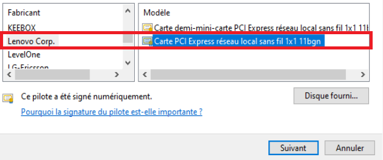

*Figure 8 — Sélection d'un pilote incompatible : une carte Wi-Fi Lenovo, alors que le matériel est une carte Ethernet Intel.*

> [!WARNING]
> **Point de vigilance.** Windows signale que le pilote est « signé numériquement ». Cela garantit seulement que le pilote n'a pas été modifié ; cela **ne garantit pas** qu'il convient au matériel. C'est exactement le piège dans lequel tombe l'utilisateur.

## 3. Symptôme constaté

Dès que l'installation se termine, Windows affiche le message **« Windows a rencontré un problème lors de l'installation de ces pilotes sur votre appareil »**. Le pilote a bien été installé, mais le périphérique **Carte PCI Express réseau local sans fil 1x1 11bgn** ne peut pas démarrer : **code 10**.

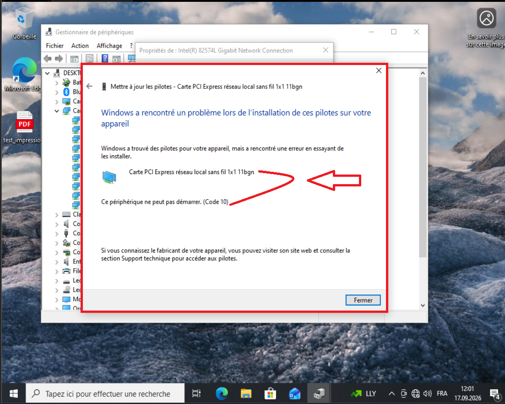

*Figure 9 — Message d'erreur après l'installation : le pilote Lenovo est chargé sur la carte, qui ne peut pas démarrer (code 10).*

Côté utilisateur, le symptôme visible est dans la zone de notification, en bas à droite de la barre des tâches : l'icône réseau est remplacée par un **globe**, ce qui signifie que le poste **n'a plus d'accès à Internet**.

*Figure 10 — Zone de notification : l'icône en forme de globe indique l'absence de connexion Internet.*

> [!NOTE]
> **Remarque.** Le **code 10** du Gestionnaire de périphériques signifie que le périphérique ne peut pas démarrer. C'est le plus souvent le signe d'un pilote absent, corrompu ou incompatible : c'est donc une piste importante pour le diagnostic.

## 4. Diagnostic

### 4.1 Ouvrir le Gestionnaire de périphériques avec une commande

Pour aller plus vite qu'avec la recherche, j'utilise le raccourci **Windows + R**, qui ouvre la fenêtre **Exécuter**. J'y tape la commande devmgmt.msc puis je valide avec **OK**.

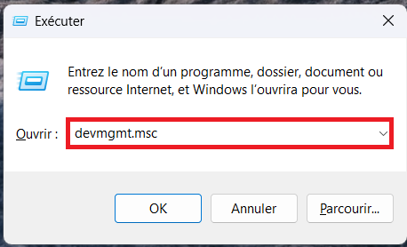

*Figure 11 — Fenêtre « Exécuter » (Windows + R) : la commande devmgmt.msc ouvre directement le Gestionnaire de périphériques.*

Le Gestionnaire de périphériques s'ouvre. Comme le problème concerne la connexion, je vais directement dans la catégorie **Cartes réseau**.

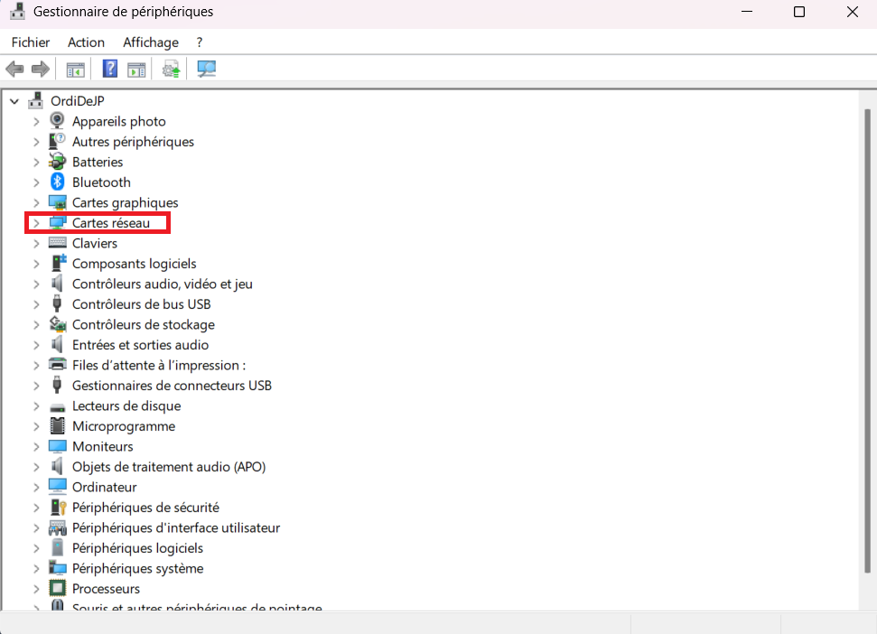

*Figure 12 — Gestionnaire de périphériques ouvert par devmgmt.msc ; la catégorie « Cartes réseau » est la première à contrôler.*

En dépliant la catégorie, on voit immédiatement le problème : la carte Intel a disparu de la liste et a été remplacée par **Carte PCI Express réseau local sans fil 1x1 11bgn**, marquée d'un **triangle jaune avec un point d'exclamation**. Ce symbole indique que le périphérique rencontre un problème.

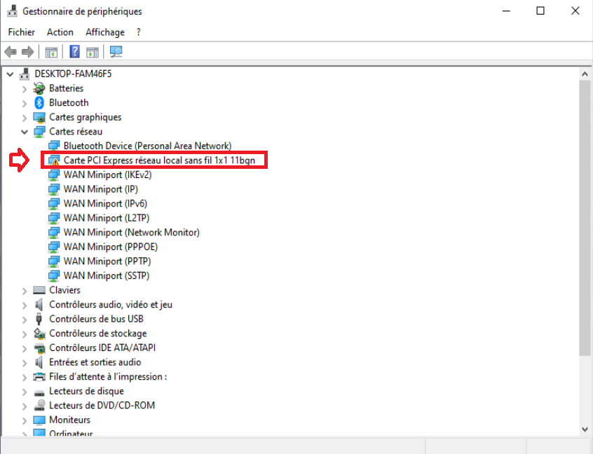

*Figure 13 — La carte réseau apparaît sous un nom incorrect (carte Wi-Fi Lenovo) avec un triangle d'avertissement jaune.*

### 4.2 Hypothèses testées

Avant de réparer, j'ai vérifié les causes possibles une par une, pour ne pas corriger au hasard :

| Hypothèse | Vérification | Résultat |
| --- | --- | --- |
| La carte réseau n'est plus détectée par Windows | La carte est toujours présente dans la catégorie « Cartes réseau » (figure 13) | Écartée |
| La carte réseau a été désactivée | Le menu contextuel propose « Désactiver l'appareil » et non « Activer » : la carte est donc activée (figure 14) | Écartée |
| Le pilote installé n'est pas le bon | Nom du périphérique incorrect (carte Wi-Fi Lenovo au lieu d'Intel Ethernet), triangle jaune et code 10 (figures 9 et 13) | **Confirmée** ✔ |

**Conclusion du diagnostic :** la panne vient d'un **pilote incompatible** installé manuellement sur la carte réseau. La solution consiste à remettre le pilote adapté au matériel.

## 5. Résolution

Je fais un clic droit sur la carte en erreur. Le menu propose plusieurs actions ; je choisis **Propriétés**, puis, dans l'onglet **Pilote**, **Mettre à jour le pilote**.

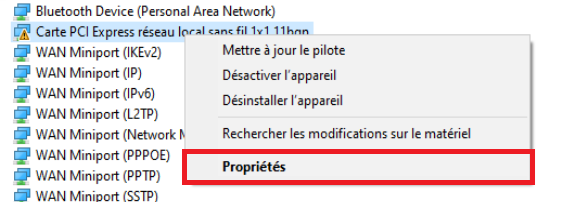

*Figure 14 — Clic droit sur la carte en erreur : menu contextuel avec « Mettre à jour le pilote », « Désactiver l'appareil » et « Propriétés ».*

> [!NOTE]
> **Remarque.** Le menu contextuel contient aussi directement **Mettre à jour le pilote** : c'est un raccourci qui mène au même assistant sans passer par les propriétés.

Cette fois, au lieu de choisir le pilote moi-même, je clique sur **Rechercher automatiquement les pilotes**. Windows va chercher sur l'ordinateur le pilote le plus adapté au matériel réellement présent, et l'installer.

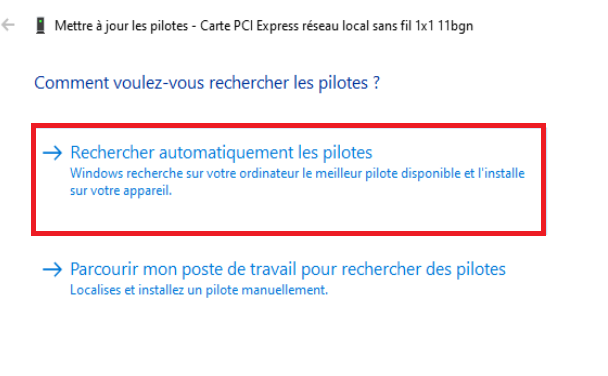

*Figure 15 — Assistant de mise à jour : choix de « Rechercher automatiquement les pilotes » pour laisser Windows identifier le bon pilote.*

Windows reconnaît le matériel et réinstalle le pilote qui aurait dû rester en place depuis le début. Le message **« Windows a mis à jour vos pilotes »** confirme l'installation pour **Intel(R) 82574L Gigabit Network Connection**.

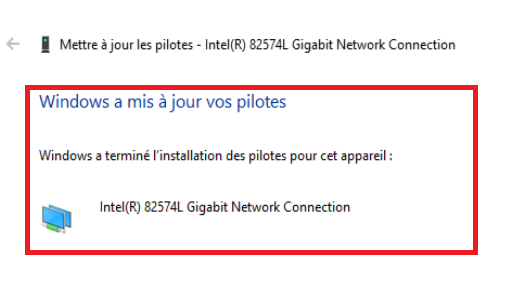

*Figure 16 — Confirmation : Windows a terminé l'installation du pilote Intel(R) 82574L Gigabit Network Connection.*

## 6. Vérification du bon fonctionnement

Pour valider l'intervention, je contrôle deux choses :

- dans le Gestionnaire de périphériques, la carte porte de nouveau son vrai nom, **Intel(R) 82574L Gigabit Network Connection**, et le **triangle jaune a disparu** ;

- dans la zone de notification, le globe a été remplacé par l'**icône de connexion réseau** habituelle : le poste a de nouveau accès au réseau.

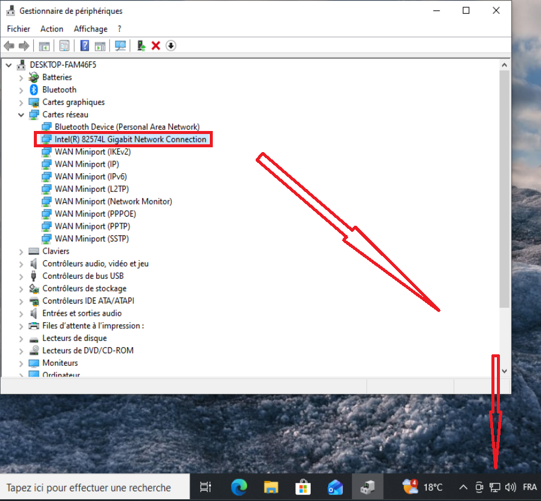

*Figure 17 — Après la réparation : la carte Intel est de retour sans avertissement et l'icône réseau de la barre des tâches est revenue à la normale.*

**Le problème est résolu** et le poste est de nouveau fonctionnel.

## 7. Recommandations

| Recommandation | Pourquoi |
| --- | --- |
| Laisser Windows rechercher automatiquement les pilotes, ou les télécharger sur le site officiel du fabricant | Évite d'installer un pilote qui ne correspond pas au matériel |
| Ne jamais décocher « Afficher les matériels compatibles » sans savoir exactement ce que l'on fait | C'est cette case qui empêche de choisir un pilote incompatible |
| Utiliser le bouton « Restaurer le pilote » (onglet Pilote) juste après une mauvaise mise à jour | Il permet de revenir directement au pilote précédent qui fonctionnait |
| Noter la version du pilote qui fonctionne (fournisseur, date, version) avant toute modification | Permet de savoir quel pilote remettre en cas de problème |
| Créer un point de restauration (ou un instantané de la VM) avant de modifier un pilote | Offre un retour arrière rapide si la manipulation tourne mal |
| Limiter l'installation de pilotes aux comptes administrateurs | Empêche un utilisateur non formé de provoquer ce type de panne |

## 8. Conclusion

La panne a été reproduite, diagnostiquée puis résolue. Le symptôme (plus d'Internet) a été relié à sa cause grâce au **Gestionnaire de périphériques** : nom de carte incorrect, triangle d'avertissement et code 10. Les autres causes possibles (carte non détectée, carte désactivée) ont été vérifiées et écartées avant d'agir. La réinstallation automatique du pilote Intel a rétabli la connexion, ce qui a été contrôlé à la fois dans le Gestionnaire de périphériques et dans la barre des tâches.

**Ce que j'ai appris.** Un pilote « signé » n'est pas forcément un pilote adapté au matériel. J'ai appris à reconnaître un périphérique en erreur (triangle jaune, code 10), à ouvrir rapidement le Gestionnaire de périphériques avec devmgmt.msc, et à suivre une démarche dans l'ordre : observer le symptôme, émettre des hypothèses, les vérifier, puis seulement réparer et contrôler le résultat.

## Annexe — Outils et raccourcis utilisés

| Outil / commande | Rôle |
| --- | --- |
| Recherche Windows (« gestion ») | Trouver et ouvrir le Gestionnaire de périphériques |
| Windows + R | Ouvrir la fenêtre Exécuter |
| devmgmt.msc | Ouvrir directement le Gestionnaire de périphériques |
| Propriétés → onglet Pilote | Consulter, mettre à jour ou restaurer le pilote d'un périphérique |
| Rechercher automatiquement les pilotes | Laisser Windows installer le pilote adapté au matériel |
| Zone de notification (icône réseau) | Contrôler rapidement l'état de la connexion |

---

Projet réalisé dans le cadre de ma formation CFC informaticien au Geneva Institute of Technology.

**[⬅ Retour à tous les projets](../README.md)** · [Mon profil](https://jp-gallego.github.io) · [LinkedIn](https://www.linkedin.com/in/jean-pierre-gallego-santillan-6b4701433)
