# Projet 5 — Déploiement standardisé d'un poste de travail par image système

> **Jean-Pierre Gallego Santillan** · Apprenti informaticien CFC · IT Essentials ICT-187 · Classe E1A · Septembre 2026

Le scénario : une entreprise doit préparer dix postes identiques pour des stagiaires. Au lieu de tout installer dix fois, on prépare un seul poste modèle, on le « généralise » avec Sysprep, puis on le copie sous forme d'image.

Je l'ai d'abord fait avec les outils de VMware, avant de me rendre compte que la consigne demandait de travailler comme sur de vrais PC. J'ai donc tout refait avec Clonezilla. Les deux méthodes sont dans le rapport, avec le temps que ça fait gagner.

## Sommaire

- [1. Introduction](#1-introduction)
- [2. Cahier des charges du poste standard](#2-cahier-des-charges-du-poste-standard)
- [3. Prérequis et environnement de travail](#3-prérequis-et-environnement-de-travail)
- [4. Préparer le poste de référence (partie commune)](#4-préparer-le-poste-de-référence-partie-commune)
- [5. Méthode A — Capture et déploiement avec VMware Workstation](#5-méthode-a--capture-et-déploiement-avec-vmware-workstation)
- [6. Méthode B — Capture et déploiement avec Clonezilla](#6-méthode-b--capture-et-déploiement-avec-clonezilla)
- [7. Test et vérification du poste déployé](#7-test-et-vérification-du-poste-déployé)
- [8. Comparatif de temps](#8-comparatif-de-temps)
- [9. Conclusion](#9-conclusion)

---

## 1. Introduction
Une entreprise accueille des stagiaires et doit mettre en service dix postes de travail configurés de manière identique. Installer et configurer chaque poste à la main prend beaucoup de temps et augmente le risque d'oublis ou d'écarts d'un poste à l'autre.

L'objectif de ce projet est de mettre en place une méthode de déploiement standardisée : un seul poste de référence est préparé selon un cahier des charges, puis il est copié sur les autres postes sous forme d'image système.

La méthode retenue est l'option A : l'image disque. Le poste de référence est généralisé avec l'outil Sysprep de Windows, puis capturé et déployé. Cette méthode copie la totalité du poste (système, comptes, logiciels et réglages) en une seule opération.

### 1.1 Pourquoi ce rapport présente deux méthodes de déploiement
La préparation du poste de référence est la même dans tous les cas : elle est décrite une seule fois au chapitre 4. C'est seulement la manière de capturer l'image et de la déployer qui change, et ce rapport en présente deux.

J'ai d'abord réalisé le déploiement avec les outils intégrés de VMware Workstation : un instantané (snapshot) du poste généralisé, un export au format OVF, puis un clone complet. Le résultat est bien un poste standardisé conforme au cahier des charges, et c'est cette méthode qui a servi au test de conformité du chapitre 7.

En relisant la consigne, je me suis rendu compte que j'avais mal compris l'exercice : il fallait travailler comme s'il n'y avait pas de machine virtuelle, c'est-à-dire capturer et déployer l'image avec un outil qui fonctionne aussi sur des postes physiques. Le snapshot et le clone VMware sont des fonctions propres à l'hyperviseur : sur de vraies machines, elles n'existent pas.

J'ai donc repris le poste de référence, qui était déjà généralisé et éteint, et j'ai refait la capture et le déploiement avec Clonezilla. C'est la méthode qui correspond à la consigne et à ce qui se pratique en entreprise.

|  | Méthode A — VMware | Méthode B — Clonezilla |
| --- | --- | --- |
| Chapitre | 5 | 6 |
| Outil de capture | Snapshot + export OVF | Clonezilla Live (savedisk) |
| Outil de déploiement | Clone complet VMware | Clonezilla Live (restoredisk) |
| Fonctionne sur un poste physique | Non | Oui |
| Correspond à la consigne | Non (erreur de ma part) | Oui |
| Résultat obtenu | Poste STAG-01 conforme | Poste déployé et fonctionnel |

## 2. Cahier des charges du poste standard
Le cahier des charges définit à quoi doit ressembler un poste stagiaire une fois déployé. Chaque ligne est volontairement vérifiable par une commande ou un écran de réglage : il sert ensuite de liste de contrôle pour le test du chapitre 7.

| Élément | Valeur attendue | Comment vérifier |
| --- | --- | --- |
| Système d’exploitation | Windows 10 64 bits, version 22H2 | winver |
| Nom du poste | STAG-01 à STAG-10 | hostname |
| Compte administrateur | adm-stagiaire, membre du groupe Administrateurs | net localgroup Administrateurs |
| Compte utilisateur | Stagiaire, utilisateur standard | net user / lusrmgr.msc |
| Compte technicien | PC_02, administrateur (créé à l’installation de Windows) | net user |
| Logiciels | Firefox, 7-Zip, VLC | Paramètres → Applications |
| Réseau | Adresse obtenue automatiquement (DHCP) | ipconfig |
| Mise en veille | Jamais, sur secteur | Paramètres → Alimentation |
| Fuseau horaire | (UTC+01:00) Amsterdam, Berlin, Berne, Rome | Paramètres → Heure et langue |

## 3. Prérequis et environnement de travail
Pour reproduire cette procédure, le technicien doit disposer de :

- un PC hôte avec VMware Workstation Pro 17 installé (ici : OrdiDeJP) ;

- l'image d'installation de Windows 10 64 bits 22H2 (fichier ISO) ;

- une machine virtuelle Windows 10 qui servira de poste de référence (ici : la VM PC_02) ;

- un accès Internet pour télécharger les logiciels ;

- environ 10 Go d'espace libre sur le PC hôte pour l'export de l'image au format OVF (méthode A) ;

- l'image ISO de Clonezilla Live et un support de stockage d'au moins 10 Go pour y écrire l'image (méthode B).

## 4. Préparer le poste de référence (partie commune)
Ce chapitre est commun aux deux méthodes. À la fin, le poste de référence est configuré selon le cahier des charges, généralisé par Sysprep et éteint : il est prêt à être capturé, quel que soit l'outil utilisé ensuite.

### 4.1 Créer la machine virtuelle de référence
J'ai commencé à 09:30 par créer une nouvelle machine virtuelle dans VMware Workstation. L'assistant demande d'abord le type de configuration.

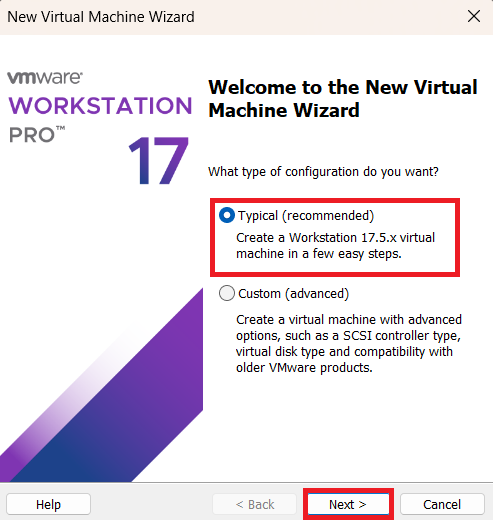
*Figure 1 — Choix du type de configuration de la nouvelle machine virtuelle*

J'ai ensuite indiqué le fichier ISO d'installation de Windows 10.

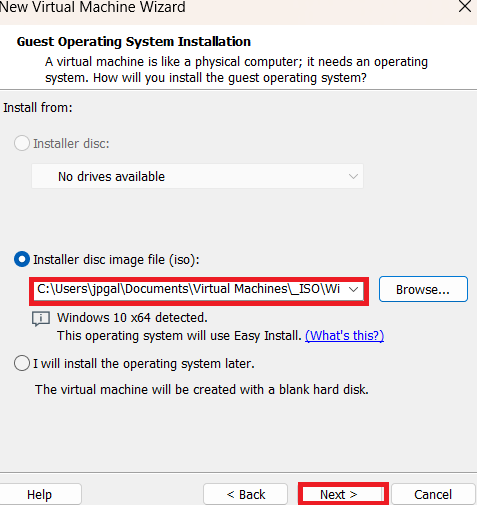
*Figure 2 — Sélection de l'image ISO d'installation de Windows 10*

Pour le disque dur, VMware recommande 60 Go. J'ai mis 75 Go pour être large, car l'image système et les logiciels vont occuper de la place.

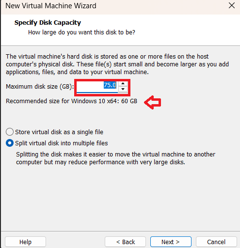
*Figure 3 — Taille du disque virtuel portée à 75 Go*

J'ai enfin ajusté la mémoire et le nombre de cœurs du processeur.

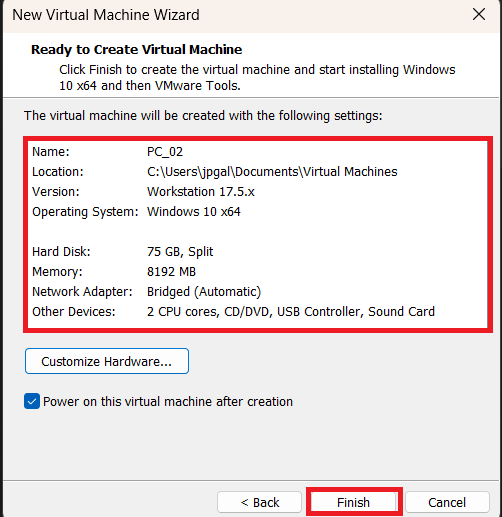
*Figure 4 — Mémoire vive et processeurs attribués à la machine virtuelle*

### 4.2 Renommer le poste
Dans la VM, ouvrir Paramètres → Système.

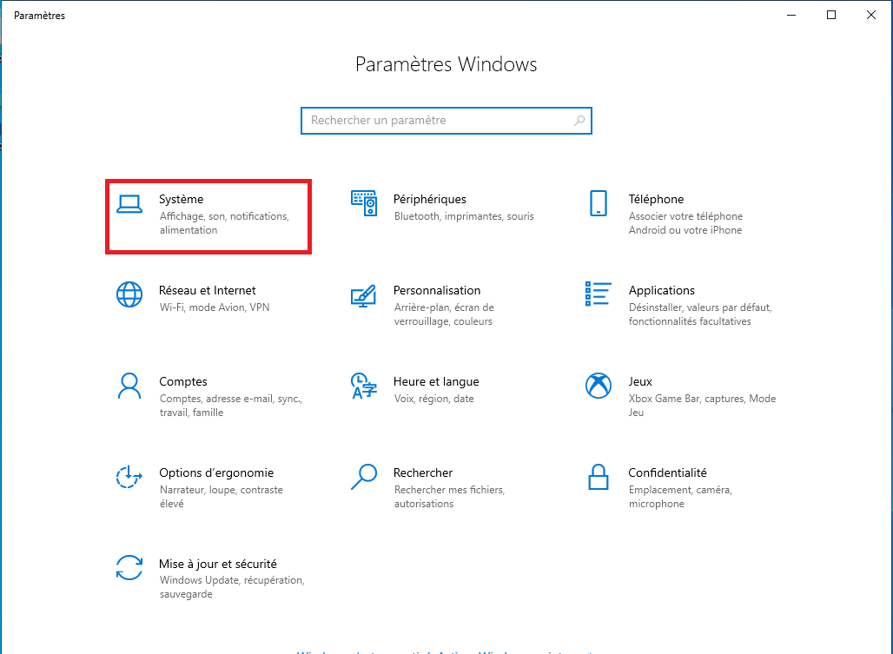
*Figure 5 — Paramètres Windows : entrée Système*

Puis Informations système → Renommer ce PC.

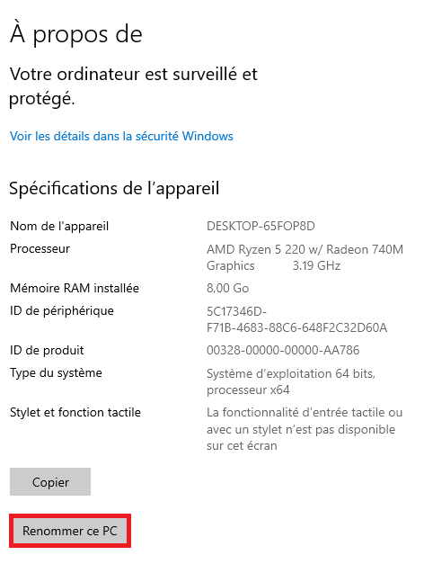
*Figure 6 — Informations système : bouton « Renommer ce PC »*

J'ai donné au poste de référence le nom Ref_Stagiaire, pour le reconnaître facilement.

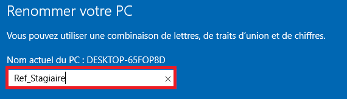
*Figure 7 — Saisie du nouveau nom du poste de référence*

Le changement de nom demande un redémarrage.

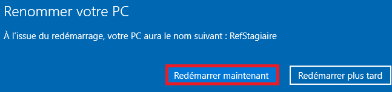
*Figure 8 — Redémarrage demandé pour appliquer le nouveau nom*

### 4.3 Créer et vérifier les comptes utilisateurs
Les comptes sont créés en ligne de commande, dans Windows PowerShell lancé en tant qu'administrateur (clic droit sur Démarrer → Windows PowerShell (admin), puis Oui) :

```powershell
net user adm-stagiaire <motdepasse> /add
net localgroup Administrateurs adm-stagiaire /add
net user Stagiaire <motdepasse> /add
```

Chaque commande doit répondre « La commande s'est terminée correctement ».

Pour vérifier, appuyer sur Windows + R et saisir lusrmgr.msc.

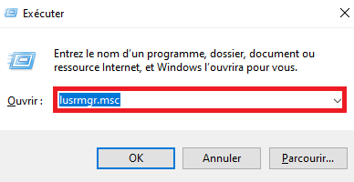
*Figure 9 — Ouverture de la console des utilisateurs locaux (lusrmgr.msc)*

Les comptes adm-stagiaire et Stagiaire apparaissent bien dans la liste, à côté du compte technicien PC_02 créé pendant l'installation de Windows.

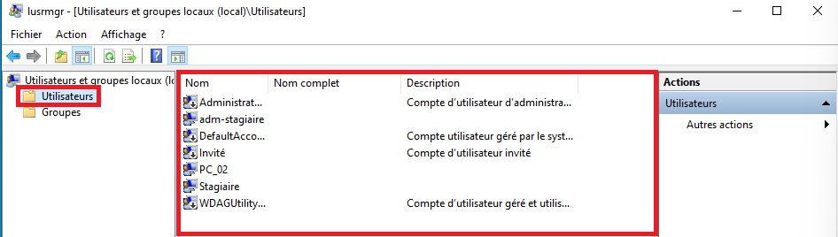
*Figure 10 — Comptes locaux du poste de référence : adm-stagiaire, Stagiaire et PC_02*

### 4.4 Installer les logiciels
Dans la VM, chaque logiciel est téléchargé uniquement depuis son site officiel : Firefox sur mozilla.org, 7-Zip sur 7-zip.org (version .exe 64 bits) et VLC sur videolan.org. Ils sont installés avec les options par défaut.

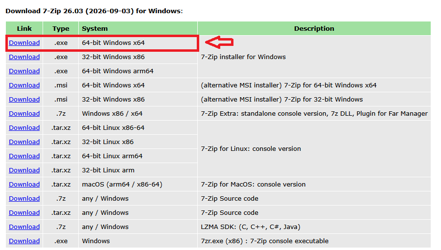
*Figure 11 — Téléchargement de 7-Zip depuis le site officiel, version 64 bits*

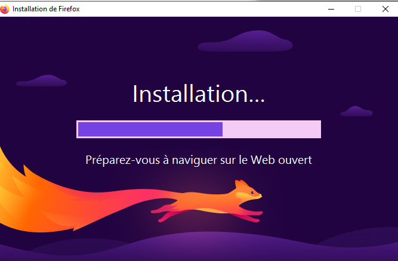
*Figure 12 — Installation de Firefox*

### 4.5 Appliquer les réglages machine
Paramètres → Système → Alimentation et mise en veille : la mise en veille sur secteur est réglée sur Jamais.

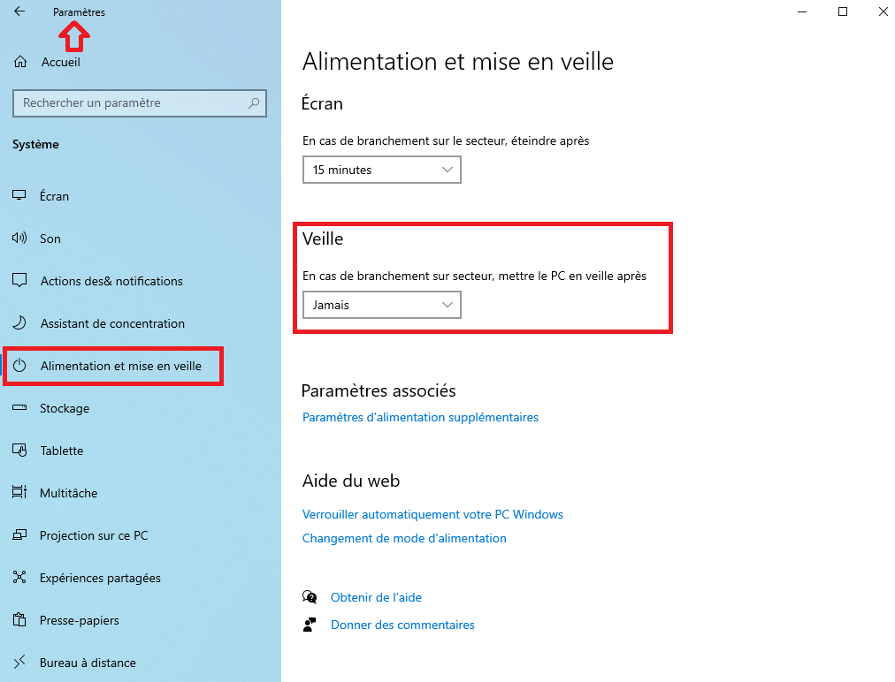
*Figure 13 — Mise en veille réglée sur « Jamais »*

Paramètres → Heure et langue : le fuseau horaire est bien (UTC+01:00) Amsterdam, Berlin, Berne, Rome, et le clavier est en Français (Suisse).

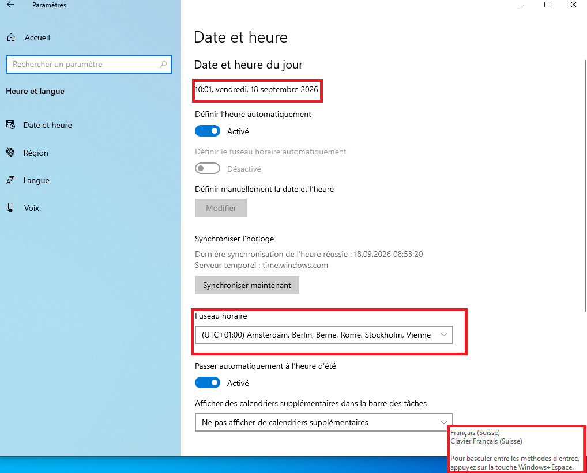
*Figure 14 — Fuseau horaire et clavier du poste de référence*

### 4.6 Vérifier le réseau
Dans PowerShell, la commande ipconfig affiche une adresse IPv4 : le DHCP fonctionne.

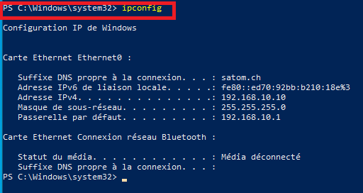
*Figure 15 — ipconfig sur le poste de référence : adresse 192.168.10.10 obtenue en DHCP*

### 4.7 Couper le réseau avant la capture
Avant de généraliser le poste, il faut débrancher la carte réseau de la machine virtuelle. Clic droit sur l'onglet de la VM → Settings.

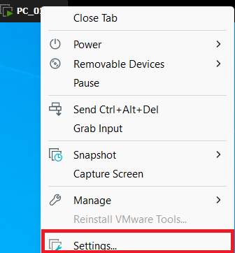
*Figure 16 — Accès aux paramètres de la machine virtuelle*

Dans Network Adapter, les deux cases Connected et Connect at power sont cochées par défaut.

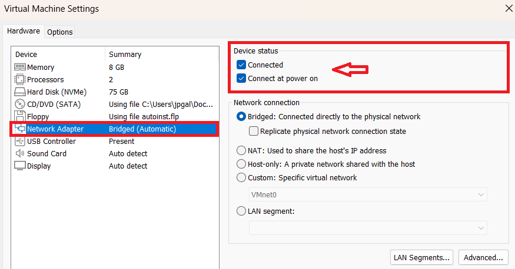
*Figure 17 — Carte réseau : état initial, les deux cases sont cochées*

Il faut les décocher toutes les deux. Connected signifie que la carte est branchée en ce moment ; Connect at power on signifie qu'elle se rebranche automatiquement au démarrage de la VM.

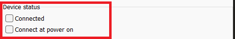
*Figure 18 — Les deux cases décochées : le réseau est coupé*

Le réseau doit être coupé avant Sysprep. Sinon, le Microsoft Store peut mettre à jour des applications en arrière-plan pendant l'opération : c'est la cause d'échec de Sysprep la plus fréquente.

### 4.8 Généraliser le poste avec Sysprep
Sysprep est un outil intégré à Windows. Il supprime les informations uniques de la machine (identifiant de sécurité SID, nom du poste, pilotes liés au matériel) tout en conservant les comptes, les logiciels et les réglages. Chaque copie de l'image pourra ainsi devenir un poste unique.

Après avoir fermé tous les programmes, appuyer sur Windows + R et saisir :

```powershell
C:\Windows\System32\Sysprep\sysprep.exe
```

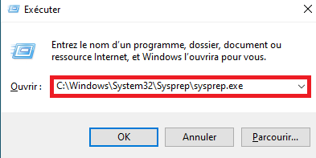
*Figure 19 — Lancement de l'outil Sysprep*

Dans la fenêtre « Outil de préparation du système », régler exactement les trois champs suivants, puis cliquer sur OK.

| Champ | Choix |
| --- | --- |
| Action de nettoyage du système | Entrer en mode OOBE (Out-of-Box Experience) |
| Généraliser | Coché |
| Options d'extinction | Arrêter le système |

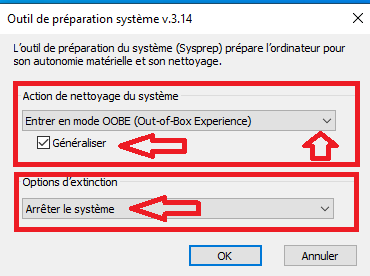
*Figure 20 — Paramètres de Sysprep : mode OOBE, Généraliser coché, Arrêter*

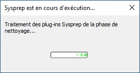
*Figure 21 — Sysprep en cours de traitement*

Après quelques minutes, la machine virtuelle s'éteint toute seule. Il était 10:10.

Une fois Sysprep passé, le poste de référence ne doit plus jamais être rallumé. Au démarrage, il se personnaliserait et ne pourrait plus servir de modèle. C'est aussi pour cette raison qu'il faut prendre un instantané avant Sysprep : si l'opération échoue, on peut revenir en arrière. Je ne l'avais pas fait, ce qui était risqué.

## 5. Méthode A — Capture et déploiement avec VMware Workstation
Cette méthode utilise uniquement les fonctions de l'hyperviseur. Elle est rapide et elle a donné le poste STAG-01 qui sert de preuve au chapitre 7, mais elle ne serait pas applicable telle quelle sur des postes physiques.

### 5.1 Capturer l'image
#### 5.1.1 Instantané du poste généralisé
La machine virtuelle étant bien éteinte, clic droit sur son onglet → Snapshot → Take Snapshot.

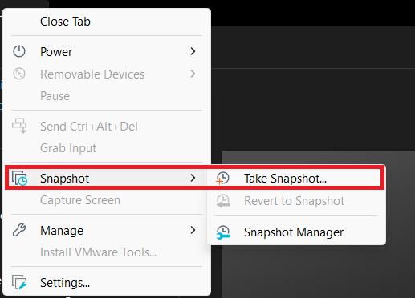
*Figure 22 — Menu VM → Snapshot → Take Snapshot*

J'ai nommé cet instantané « Image généralisée ».

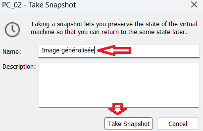
*Figure 23 — Instantané nommé « Image généralisée »*

Le Snapshot Manager (VM → Snapshot → Snapshot Manager) permet de vérifier que l'instantané existe bien.

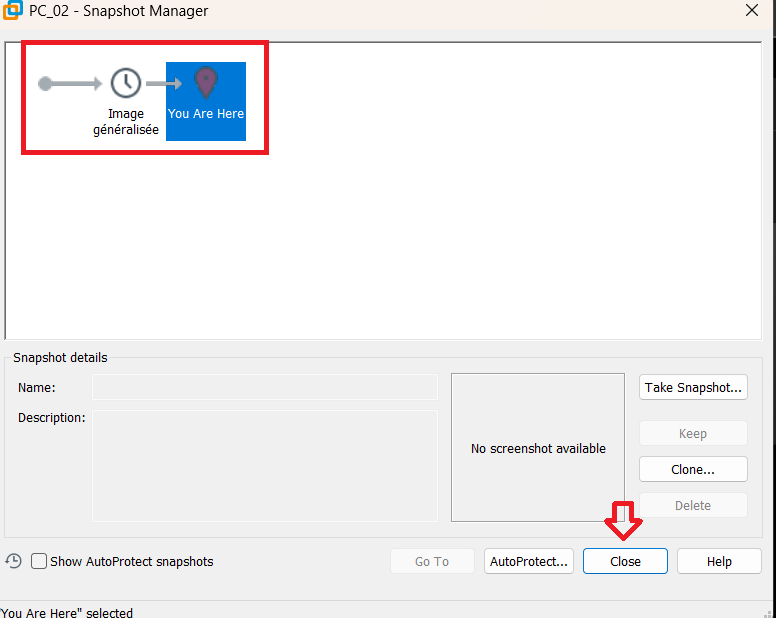
*Figure 24 — L'instantané « Image généralisée » dans le Snapshot Manager*

#### 5.1.2 Exporter l'image au format OVF
L'instantané reste à l'intérieur de VMware. Pour obtenir un livrable transportable, j'ai exporté la machine au format OVF. Sur le PC hôte, j'ai d'abord créé un dossier de destination, puis, la VM PC_02 étant sélectionnée : File → Export to OVF…

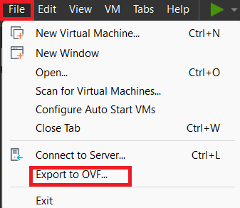
*Figure 25 — Menu File → Export to OVF…*

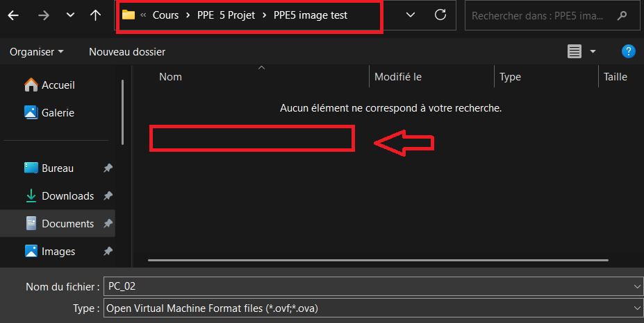
*Figure 26 — Choix du dossier de destination de l'image exportée*

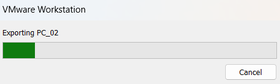
*Figure 27 — Export en cours (plusieurs minutes)*

À la fin de l'export, je suis retourné dans le dossier pour contrôler que les fichiers étaient bien présents.

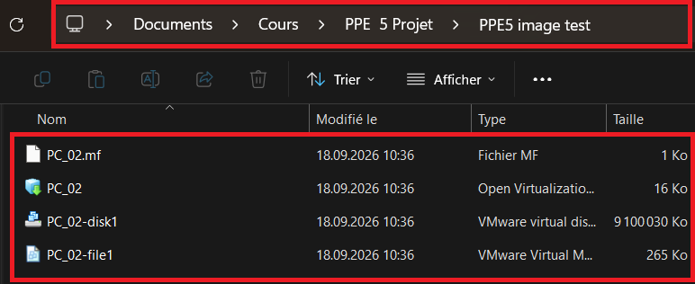
*Figure 28 — Fichiers de l'image exportée au format OVF*

| Fichier | Rôle |
| --- | --- |
| PC_02.ovf | Description de la machine : mémoire, processeur, carte réseau… |
| PC_02-disk1.vmdk | Disque dur contenant Windows, les comptes et les logiciels (environ 9,1 Go) |
| PC_02.mf | Contrôle d'intégrité des fichiers |
| PC_02-file1 | Réglages du BIOS virtuel de la machine |

Ce dossier OVF est l'image système de la méthode A : il permet de recréer le poste standard sur n'importe quel ordinateur disposant de VMware. Il était 10:40.

### 5.2 Déployer un poste depuis l’image
Le déploiement se fait par clonage de l'instantané. Ouvrir le Snapshot Manager de PC_02.

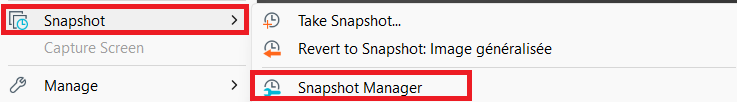
*Figure 29 — Ouverture du Snapshot Manager*

Sélectionner l'instantané « Image généralisée », puis cliquer sur Clone…

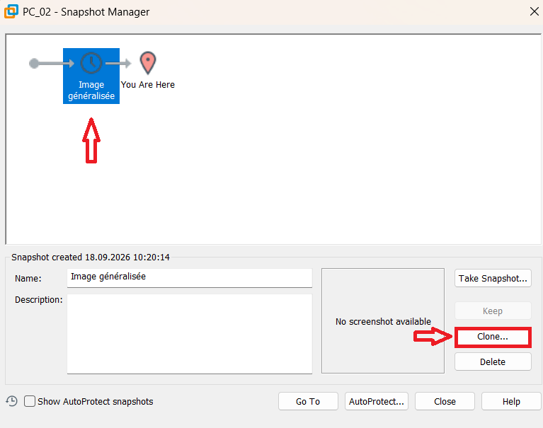
*Figure 30 — Sélection de l'instantané et bouton Clone…*

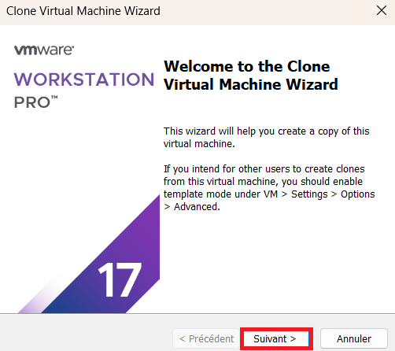
*Figure 31 — Assistant de clonage de machine virtuelle*

Dans l'assistant, choisir An existing snapshot et l'instantané « Image généralisée ».

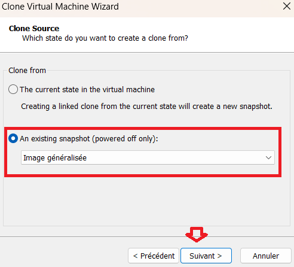
*Figure 32 — Source du clone : l'instantané généralisé*

Choisir ensuite Create a full clone : le clone est une copie complète et indépendante, contrairement au clone lié qui reste rattaché à la machine d'origine.

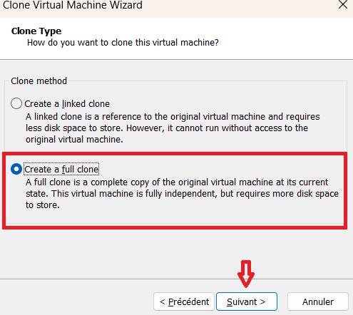
*Figure 33 — Type de clone : clone complet*

Enfin, nommer la nouvelle machine STAG-01 et terminer.

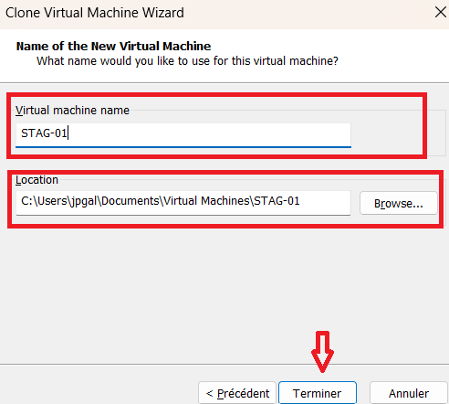
*Figure 34 — Nom de la machine déployée : STAG-01*

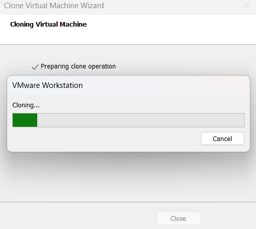
*Figure 35 — Clonage en cours*

### 5.3 Premier démarrage et finalisation
Le clone STAG-01 est démarré (surtout pas PC_02). Comme le poste a été généralisé, Windows relance l'écran d'accueil, qui correspond à l'état « avant déploiement » du poste.

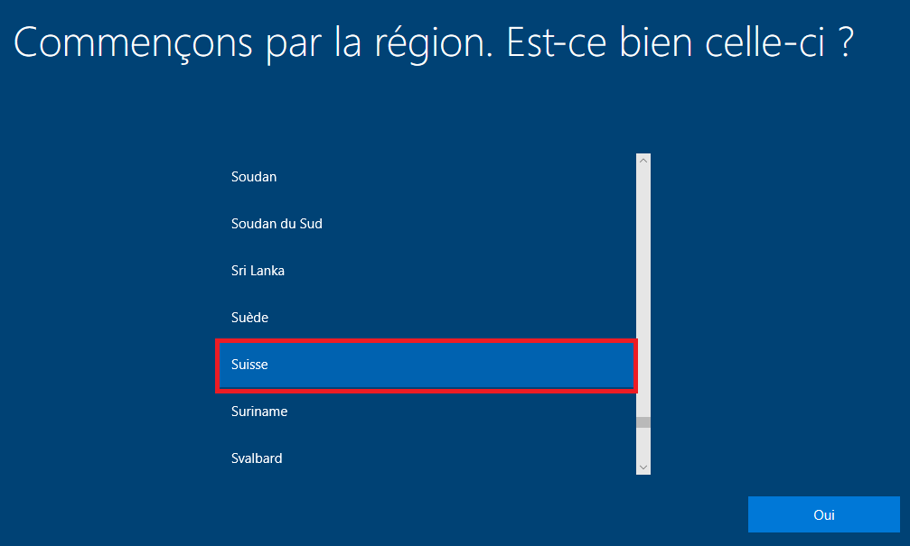
*Figure 36 — Écran d'accueil du clone : choix de la région (Suisse)*

Le réseau étant volontairement débranché, il faut cliquer sur « Je n'ai pas Internet », puis « Continuer avec une configuration limitée ».

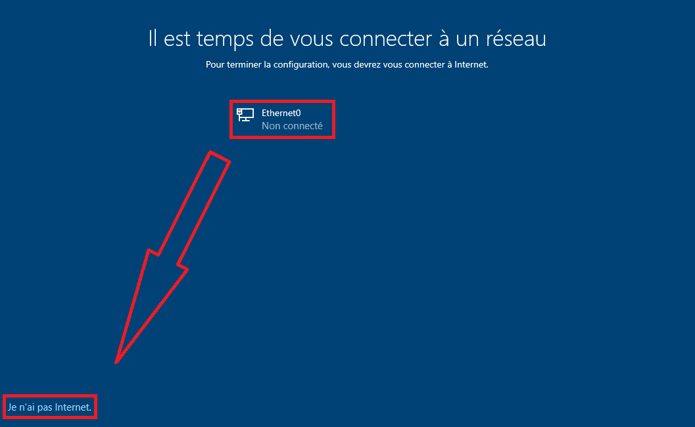
*Figure 37 — Pas de réseau : « Je n'ai pas Internet »*

Windows oblige à créer un compte à cette étape. J'ai créé un compte temporaire nommé temp, sans mot de passe, qui sera supprimé à la fin (voir le tableau de conformité, chapitre 7). Les options de confidentialité ont toutes été mises sur Non.

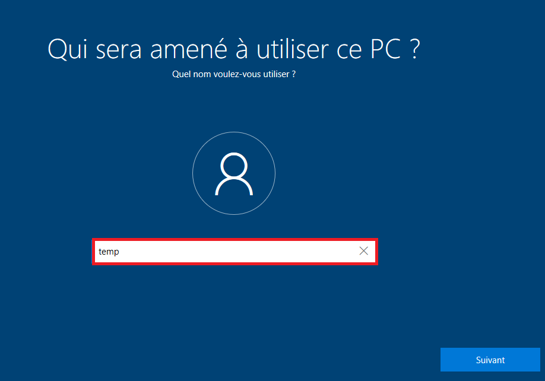
*Figure 38 — Création du compte temporaire temp*

Une fois le bureau affiché, il reste à donner au poste son nom définitif. Clic droit sur Démarrer → Windows PowerShell (admin).

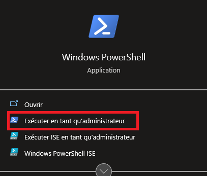
*Figure 39 — Ouverture de PowerShell en tant qu'administrateur*

```powershell
Rename-Computer -NewName STAG-01 -Restart
```

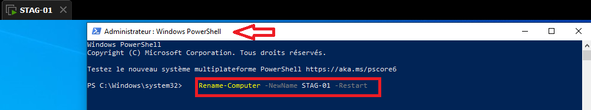
*Figure 40 — Renommage du poste en STAG-01*

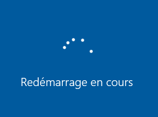
*Figure 41 — Redémarrage du poste*

Après le redémarrage, le poste ouvre un bureau Windows 10 avec Firefox, VLC et 7-Zip déjà installés : le déploiement a bien recopié la configuration du poste de référence. Il était 11:08. Dans VMware, il reste à recocher Connected et Connect at power on pour rebrancher le réseau.

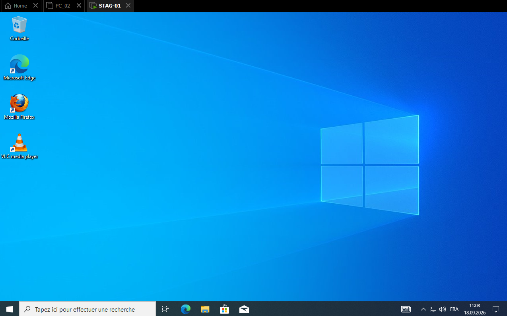
*Figure 42 — Bureau du poste STAG-01 après déploiement, logiciels déjà présents*

Pour les postes suivants, il suffit de répéter les points 5.2 et 5.3 en changeant le nom : STAG-02, STAG-03, jusqu'à STAG-10.

## 6. Méthode B — Capture et déploiement avec Clonezilla
Clonezilla est un logiciel libre de clonage de disques. Il démarre depuis un CD ou une clé USB, indépendamment du système installé, et sait copier un disque entier dans une image compressée puis réécrire cette image sur un autre disque. C'est l'outil qui correspond à la consigne, parce qu'il fonctionne exactement de la même façon sur une machine virtuelle et sur un poste physique.

Le point de départ est le poste de référence du chapitre 4 : déjà généralisé par Sysprep et éteint. Rien n'est refait côté configuration ; seules la capture et la restauration changent.

### 6.1 Préparer les supports
L'image ISO de Clonezilla Live est téléchargée depuis le site officiel clonezilla.org, en architecture amd64 et en type de fichier iso.

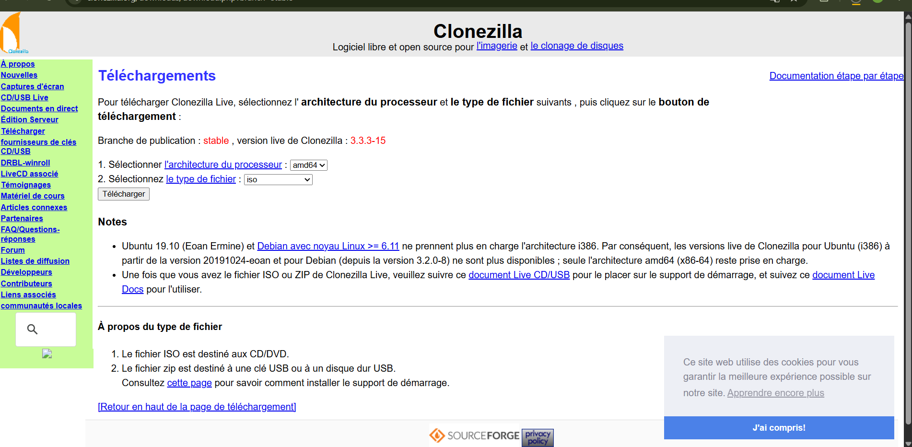
*Figure 43 — Page de téléchargement officielle de Clonezilla Live*

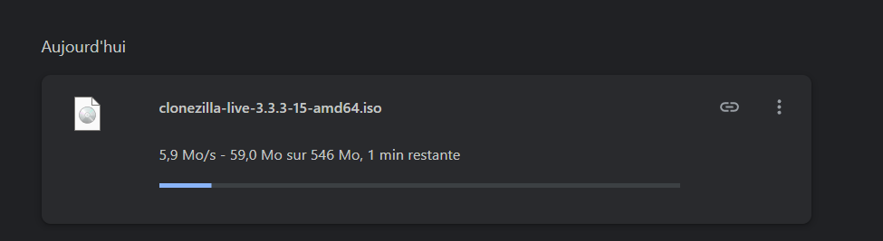
*Figure 44 — Téléchargement de clonezilla-live-3.3.3-15-amd64.iso*

Clonezilla doit écrire l'image quelque part, et jamais sur le disque qu'il est en train de sauvegarder. Sur un poste physique, ce serait un disque externe ou une clé USB. Ici, j'ai ajouté un deuxième disque virtuel à la machine de référence, qui joue ce rôle de support de stockage. Dans les paramètres de la VM : Add… → Hard Disk.

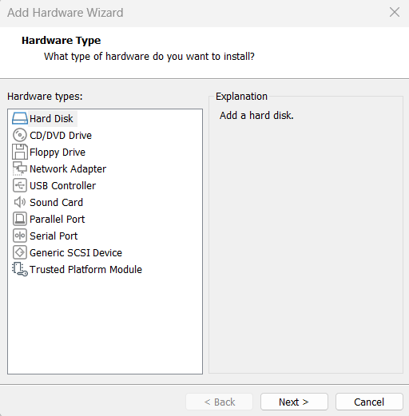
*Figure 45 — Assistant d'ajout de matériel : ajout d'un disque dur*

J'ai choisi le type SATA, pour bien le distinguer du disque système qui est en NVMe.

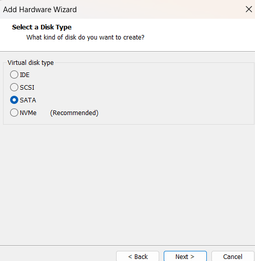
*Figure 46 — Type de disque : SATA*

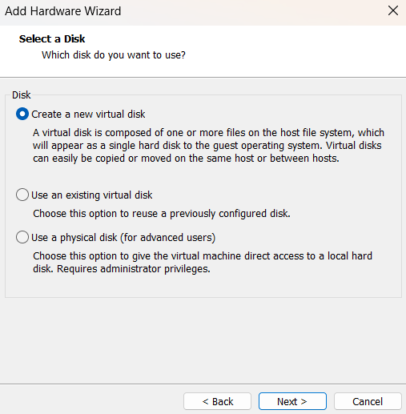
*Figure 47 — Création d'un nouveau disque virtuel*

Capacité : 75 Go, largement suffisant pour une image compressée d'un disque de 75 Go peu rempli.

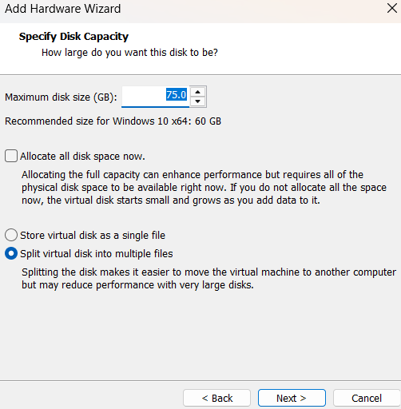
*Figure 48 — Capacité du disque de stockage : 75 Go*

Je l'ai nommé Stock_image, pour le reconnaître facilement plus tard.

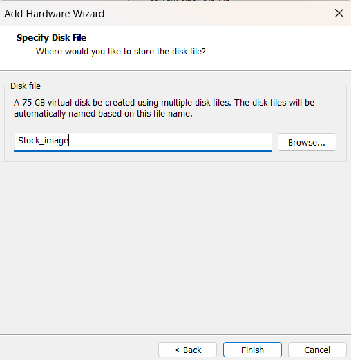
*Figure 49 — Nom du disque de stockage : Stock_image*

Enfin, le lecteur CD/DVD de la machine est pointé sur l'ISO de Clonezilla, avec Connect at power on coché.

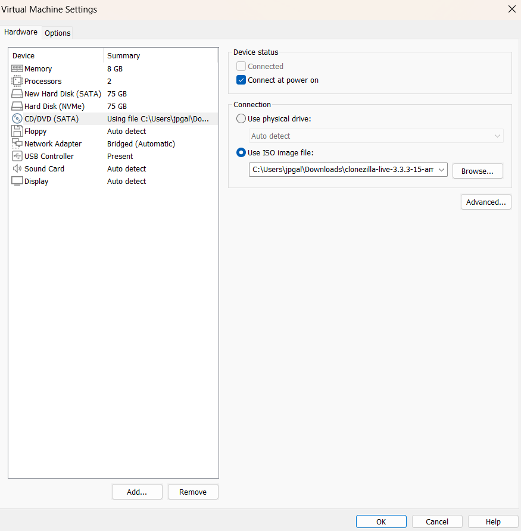
*Figure 50 — Poste de référence : disque de stockage SATA ajouté et ISO Clonezilla montée*

### 6.2 Démarrer le poste de référence sur Clonezilla
Au démarrage de la machine, il faut forcer le démarrage sur le lecteur CD-ROM plutôt que sur le disque Windows.


*Figure 51 — Boot Manager : démarrage sur le lecteur CD-ROM*

Le menu de Clonezilla Live s'affiche ; la première entrée, Clonezilla live (VGA 800x600), convient.


*Figure 52 — Menu de démarrage de Clonezilla Live*

Clonezilla demande ensuite la langue, puis la disposition du clavier (j’ai conservé la disposition par défaut).


*Figure 53 — Choix de la langue*


*Figure 54 — Configuration du clavier*

Enfin, on choisit Start_Clonezilla pour entrer dans l'assistant.


*Figure 55 — Lancement de l'assistant Clonezilla*

Le mode à choisir est device-image : disque ou partition vers ou depuis une image. C'est bien ce que l'on veut faire, contrairement au mode device-device qui copierait directement un disque sur un autre.


*Figure 56 — Mode device-image : disque vers image*

### 6.3 Préparer le dépôt d'images
Clonezilla demande ensuite où stocker l'image. Il propose de monter une partition sous /home/partimag, mais seules les partitions du disque système apparaissent : le disque Stock_image que je venais d'ajouter est vide, il n'a ni table de partition ni système de fichiers, donc Clonezilla ne le voit pas.


*Figure 57 — Le disque de stockage n'apparaît pas dans la liste des partitions*

Il faut donc le préparer à la main. Je suis ressorti de l'assistant en choisissant Enter_shell pour passer en ligne de commande.


*Figure 58 — Sortie vers la ligne de commande (Enter_shell)*

Première commande : créer une table de partition GPT sur le disque /dev/sda (le disque SATA ajouté).

```bash
sudo parted /dev/sda mklabel gpt
```


*Figure 59 — Création de la table de partition GPT*

Deuxième commande : créer une partition qui occupe tout le disque.

```bash
sudo parted /dev/sda mkpart primary ext4 0% 100%
```


*Figure 60 — Création de la partition sur tout le disque*

Troisième commande : formater cette partition en ext4, le système de fichiers de Linux.

```bash
sudo mkfs.ext4 /dev/sda1
```


*Figure 61 — Formatage de la partition en ext4*

Il faut bien vérifier le nom du disque avant de taper ces commandes : elles effacent tout ce qui se trouve dessus. Ici /dev/sda est le disque de stockage vide et /dev/nvme0n1 est le disque Windows à sauvegarder. Se tromper de nom détruirait le poste de référence.

En relançant Clonezilla, la partition sda1 de 75 Go en ext4 apparaît maintenant et peut être choisie comme dépôt d'images.


*Figure 62 — La partition sda1 est maintenant reconnue par Clonezilla*

Clonezilla propose ensuite de vérifier le système de fichiers : la partition venant d'être créée, j'ai choisi no-fsck.


*Figure 63 — Vérification du système de fichiers : no-fsck*

Puis il faut indiquer dans quel répertoire du dépôt ranger l'image. J'ai gardé la racine « / ».


*Figure 64 — Choix du répertoire de l'image : la racine du dépôt*


*Figure 65 — Réglage du fuseau horaire de Clonezilla*

### 6.4 Sauvegarder le disque dans une image (savedisk)
Le mode Beginner suffit : il applique les options par défaut, qui conviennent pour un disque Windows.


*Figure 66 — Mode assistant : Beginner*

L'opération à exécuter est savedisk : sauvegarder le disque local dans une image. C'est l'équivalent de la capture d'image.


*Figure 67 — Opération : savedisk*

Le disque source est nvme0n1, le disque de 75 Go qui contient Windows. On le sélectionne avec la barre d'espace : une étoile apparaît devant.


*Figure 68 — Sélection du disque source : le disque système nvme0n1*

Pour la compression, j'ai gardé la proposition par défaut (-z1p, compression gzip parallèle), qui est un bon compromis entre vitesse et taille.


*Figure 69 — Méthode de compression : gzip parallèle*

J'ai demandé à Clonezilla de vérifier après coup que l'image est bien restaurable. Cette vérification n'écrit rien sur le disque, elle ne fait que relire l'image.


*Figure 70 — Vérification de l'image après la sauvegarde*

Enfin, j'ai choisi d'éteindre la machine une fois l'opération terminée.


*Figure 71 — Action finale : arrêter la machine*

Clonezilla lance alors Partclone, qui copie les partitions une par une. Partclone ne recopie que les blocs réellement utilisés, ce qui explique qu'un disque de 75 Go tienne dans une image de quelques gigaoctets.


*Figure 72 — Sauvegarde en cours avec Partclone*


*Figure 73 — Le poste de référence est éteint : la capture est terminée*

L'image occupe environ 7,6 Go sur le disque de stockage, pour un disque source de 75 Go.

### 6.5 Déployer l'image sur un poste vierge (restoredisk)
Pour le déploiement, j'ai utilisé une deuxième machine, avec un disque système de 75 Go entièrement vide : c'est l'équivalent d'un poste neuf sorti du carton.


*Figure 74 — Poste cible : un disque système vierge de 75 Go*

Il faut lui donner accès à l'image. Sur un poste physique, on brancherait le disque externe ; ici, j'ai rattaché le disque Stock_image à cette machine : Add… → Hard Disk → SATA, puis Use an existing virtual disk.


*Figure 75 — Type de disque : SATA*


*Figure 76 — Utilisation d'un disque virtuel existant*


*Figure 77 — Les fichiers de l'image, environ 7,6 Go au total*


*Figure 78 — Sélection du fichier Stock_image.vmdk*

Le lecteur CD/DVD est là aussi pointé sur l'ISO de Clonezilla.


*Figure 79 — Poste cible : disque de stockage rattaché et ISO Clonezilla montée*

La machine est démarrée sur le CD-ROM, comme au point 6.2.


*Figure 80 — Démarrage du poste cible sur Clonezilla*

Au moment de choisir le mode, il ne faut pas se tromper : remote-source et remote-dest servent au clonage entre deux machines reliées par le réseau, ce qui n'est pas le cas ici. Le mode à choisir reste device-image.


*Figure 81 — Modes disponibles : ne pas confondre avec les modes distants*

Cette fois, l'opération à exécuter est restoredisk : restaurer une image vers le disque local. C'est l'inverse de savedisk.


*Figure 82 — Opération : restoredisk*

restoredisk écrase entièrement le disque de destination. Sur un poste qui contient encore des données, tout est perdu. C'est pour cela que le poste cible doit être un poste neuf ou déjà sauvegardé.

Une fois la restauration terminée, il faut remettre la machine dans son état normal : retirer le disque de stockage, qui ne fait pas partie du poste standard…


*Figure 83 — Retrait du disque de stockage après la restauration*

…et remettre le lecteur CD/DVD sur le lecteur physique, pour que la machine ne redémarre plus sur Clonezilla.


*Figure 84 — Retrait de l'ISO Clonezilla du lecteur CD/DVD*

### 6.6 Résultat du déploiement
La capture et la restauration se sont déroulées sans erreur. Au redémarrage, la machine amorce bien sur le disque restauré : Windows passe la phase d'accueil, puis ouvre une session sur le bureau. Le poste déployé avec Clonezilla est donc fonctionnel.


*Figure 85 — Bureau du poste déployé avec Clonezilla : le système démarre normalement*

Le menu Démarrer s'ouvre et les tuiles sont bien celles du poste de référence : l'image a donc restitué le profil et les applications, et pas seulement le système.


*Figure 86 — Menu Démarrer du poste déployé avec Clonezilla*

Le déploiement fonctionne donc avec les deux méthodes. Clonezilla a l'avantage de s'appliquer de la même façon à des postes physiques : la même image, copiée sur une clé USB ou un disque externe, permettrait de déployer les dix postes stagiaires sans machine virtuelle.

## 7. Test et vérification du poste déployé

### Tableau de conformité

| Élément | Attendu | Constaté | Conforme |
| --- | --- | --- | --- |
| Système d'exploitation | Windows 10 64 bits 22H2 | Windows 10 Éducation, version 22H2 (build 19045.2965) | Oui \* |
| Nom du poste | STAG-01 | STAG-01 | Oui |
| Compte administrateur | adm-stagiaire dans Administrateurs | Présent dans le groupe Administrateurs | Oui |
| Compte utilisateur | Stagiaire, utilisateur standard | Présent, hors du groupe Administrateurs | Oui |
| Compte technicien | PC_02, administrateur | Présent | Oui |
| Logiciels | Firefox, 7-Zip, VLC | Les trois sont installés | Oui |
| Réseau | DHCP | 192.168.10.130, passerelle 192.168.10.1 | Oui |
| Mise en veille | Jamais | Jamais | Oui |
| Fuseau horaire et langue | (UTC+01:00) Berne | Français (Suisse), UTC+01:00 | Oui |
| Compte temporaire | Aucun compte en trop | Compte temp supprimé | Oui |

\* L'édition installée est Windows 10 Éducation ; le cahier des charges portait sur la version (22H2, 64 bits), qui est bien respectée.

## 8. Comparatif de temps
| Opération | Début → fin | Durée |
| --- | --- | --- |
| Installation manuelle complète d'un poste (Windows, comptes, logiciels, réglages) | 08:45 → 10:10 | environ 1 h 25 |
| Création de l'image (Sysprep, instantané, export OVF) | 10:10 → 10:40 | environ 30 min |
| Déploiement d'un poste depuis l'image (clone, premier démarrage, finalisation) | 10:40 → 11:08 | environ 30 min |

Pour dix postes, cela donne :

| Méthode | Calcul | Total |
| --- | --- | --- |
| Installation manuelle | 10 × 1 h 25 | environ 14 h 10 |
| Déploiement par image | 1 h 25 (poste de référence) + 30 min (image) + 10 × 30 min | environ 6 h 55 |
| Temps gagné |  | environ 7 h 15, soit la moitié |

## 9. Conclusion
Ce projet m'a permis de déployer un poste de travail standardisé à partir d'une image système, avec deux outils différents. Le poste STAG-01 obtenu par clonage VMware est entièrement conforme au cahier des charges, et le déploiement refait avec Clonezilla aboutit lui aussi à un poste fonctionnel, avec une méthode qui s'appliquerait telle quelle à des machines physiques. Le déploiement par image permet de diviser par deux le temps nécessaire pour dix postes, avec une marge de progression importante une fois la procédure maîtrisée.

### 9.1 Ce que j'ai appris
- Le principe d'une image système : préparer un seul poste modèle, puis le copier, au lieu de refaire l'installation sur chaque poste.

- Le rôle de Sysprep : rendre une installation Windows générique en supprimant ce qui est unique à la machine, tout en gardant les comptes, les logiciels et les réglages.

- Les instantanés, le clonage et l'export OVF dans VMware Workstation.

- Le fonctionnement de Clonezilla : les modes device-image, savedisk et restoredisk, et l'obligation de disposer d'un support de stockage distinct du disque sauvegardé.

- Quelques commandes Linux de base pour préparer un disque : parted et mkfs.ext4.

- Créer et gérer des comptes en ligne de commande avec net user et net localgroup.

- L'importance d'un cahier des charges vérifiable, qui sert ensuite de liste de contrôle pour le test.

### 9.2 Difficultés rencontrées
- J'ai d'abord mal compris la consigne et réalisé le déploiement avec les outils de VMware, alors qu'il fallait travailler comme sur des postes physiques. J'ai refait la manipulation avec Clonezilla.

- J'ai oublié de prendre un instantané avant Sysprep. Si l'opération avait échoué, je n'aurais pas pu revenir en arrière.

- Clonezilla ne voyait pas le disque de stockage neuf, parce qu'il n'avait ni partition ni système de fichiers. Il a fallu le préparer en ligne de commande.

- La suppression du compte temp a d'abord renvoyé « Accès refusé », parce que PowerShell n'était pas lancé en administrateur.

### 9.3 Améliorations possibles
- Toujours prendre un instantané du poste de référence avant de lancer Sysprep.

- Utiliser un fichier de réponse (option B du projet) pour automatiser l'écran d'accueil et éviter la création du compte temporaire.

- Préparer une clé USB Clonezilla permanente, pour ne pas avoir à remonter l'ISO à chaque poste.

- Déployer plusieurs postes en parallèle pour réduire encore le temps total.

---

<sub>Projet réalisé dans le cadre de ma formation CFC informaticien au Geneva Institute of Technology.</sub>

**[⬅ Retour à tous les projets](../README.md)** · [Mon profil](https://jp-gallego.github.io) · [LinkedIn](https://www.linkedin.com/in/jean-pierre-gallego-santillan-6b4701433)
