# Mon premier réseau routé sous GNS3 : 2 routeurs Cisco, DHCP et routage statique

> **Jean-Pierre Gallego Santillan** · Apprenti informaticien CFC (1re année) · Septembre 2026

**Mots-clés :** `GNS3` `Cisco IOS` `DHCP` `Routage statique` `Réseau` `Portfolio`

> [!NOTE]
> **En bref** : au départ, c'était un petit exercice de cours (configurer un routeur Cisco et un PC dans GNS3). J'ai voulu aller plus loin et j'en ai fait un mini-projet : **deux réseaux séparés, chacun avec son routeur qui distribue les adresses IP (DHCP), puis reliés entre eux** pour que n'importe quel PC puisse joindre n'importe quel autre.
>
> Résultat : 2 routeurs, 2 switchs, 6 PC, 3 réseaux, et des pings qui passent d'un bout à l'autre. ✔

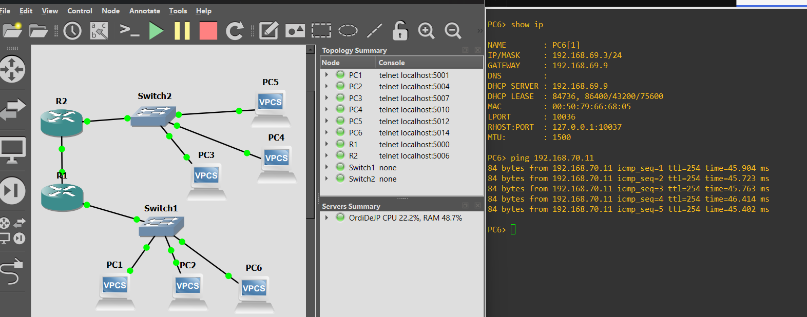
*Figure 1 — Le projet dans GNS3 : la topologie, les appareils démarrés et un PC qui teste la connexion vers l'autre réseau.*

## Sommaire

- [Ce que ce projet montre](#ce-que-ce-projet-montre)
- [1. L'environnement](#1-lenvironnement)
- [2. La topologie et le plan d'adressage](#2-la-topologie-et-le-plan-dadressage)
- [3. Configurer le routeur R1 (adresse IP + DHCP)](#3-configurer-le-routeur-r1-adresse-ip--dhcp)
- [4. Configurer R2 (même principe, autre réseau)](#4-configurer-r2-même-principe-autre-réseau)
- [5. Les PC reçoivent leur adresse par DHCP](#5-les-pc-reçoivent-leur-adresse-par-dhcp)
- [6. Relier les deux réseaux](#6-relier-les-deux-réseaux)
- [7. Les tests](#7-les-tests)
- [8. Bonus : le DHCP vu dans Wireshark](#8-bonus--le-dhcp-vu-dans-wireshark)
- [9. Les problèmes rencontrés (et comment je les ai réglés)](#9-les-problèmes-rencontrés-et-comment-je-les-ai-réglés)
- [10. Ce que j'ai appris](#10-ce-que-jai-appris)
- [11. Pour aller plus loin](#11-pour-aller-plus-loin)
- [Récap : toutes les commandes](#récap--toutes-les-commandes)

---

## Ce que ce projet montre

| Compétence | Concrètement |
|---|---|
| Simulation réseau | Installation de GNS3, import d'une image Cisco IOS (c7200), réglage de l'Idle-PC |
| Adressage IP | Découpage en 3 réseaux /24, choix des passerelles, adresses fixes pour les routeurs |
| Cisco IOS (CLI) | `hostname`, configuration d'interfaces, `no shutdown`, sauvegarde avec `wr` |
| DHCP | Un serveur DHCP sur chaque routeur, exclusion de l'adresse du routeur, vérification des baux |
| Routage | Routes statiques pour faire communiquer deux réseaux |
| Tests et dépannage | `ping`, `show ip interface brief`, `show ip route`, lecture du TTL, capture Wireshark |

---

## 1. L'environnement

- **GNS3 2.2.61** sous Windows (avec WinPCAP, Npcap et **Wireshark** pour pouvoir capturer le trafic)
- **Routeurs** : Cisco 7200 émulés (image IOS `c7200-adventerprisek9-mz.152-4.M11`, IOS 15.2)
- **Switchs** : switchs Ethernet intégrés à GNS3
- **PC** : VPCS (PC virtuels très légers, parfaits pour tester le DHCP et le ping)

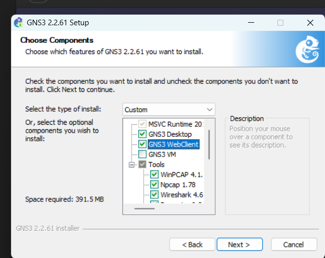
*Figure 2 — Installation de GNS3 : je garde les outils (WinPCAP, Npcap, Wireshark) pour pouvoir capturer le trafic plus tard.*

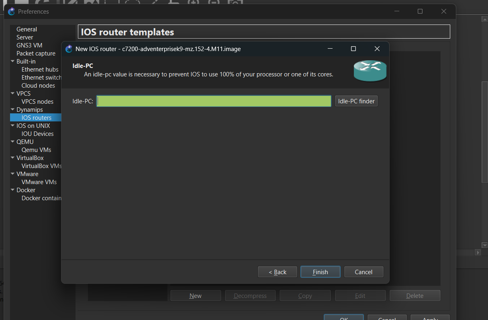
*Figure 3 — Ajout du routeur c7200. L'**Idle-PC** évite que le routeur émulé utilise 100 % d'un cœur du processeur.*

---

## 2. La topologie et le plan d'adressage

L'idée : **chaque routeur a « son » réseau de PC**, et on ajoute un 3e petit réseau, le **« pont »**, uniquement pour le câble entre les deux routeurs.

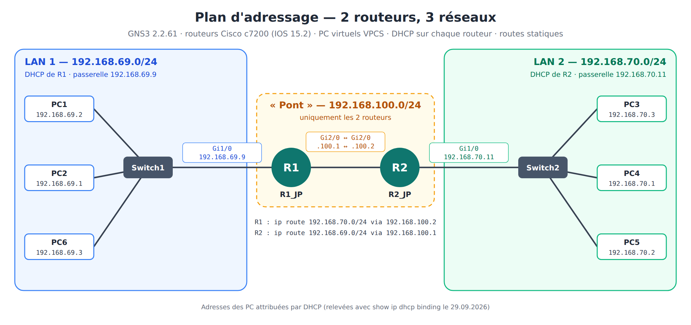
*Figure 4 — Plan d'adressage du projet.*

| Réseau | Rôle | Passerelle / adresses fixes | Appareils |
|---|---|---|---|
| `192.168.69.0/24` | LAN 1 | R1 Gi1/0 = `192.168.69.9` | PC1, PC2, PC6 (via Switch1) |
| `192.168.100.0/24` | Pont R1 ↔ R2 | R1 Gi2/0 = `.100.1` · R2 Gi2/0 = `.100.2` | Seulement les 2 routeurs |
| `192.168.70.0/24` | LAN 2 | R2 Gi1/0 = `192.168.70.11` | PC3, PC4, PC5 (via Switch2) |

> [!TIP]
> **Pourquoi 3 réseaux différents ?** Un routeur sert justement à relier des réseaux *différents*. C'est comme deux villes : si Lausanne et Genève avaient la même adresse postale, la poste ne saurait pas où livrer la lettre. Avec `.69` d'un côté et `.70` de l'autre, chaque routeur sait si un paquet reste chez lui ou doit partir vers l'autre.

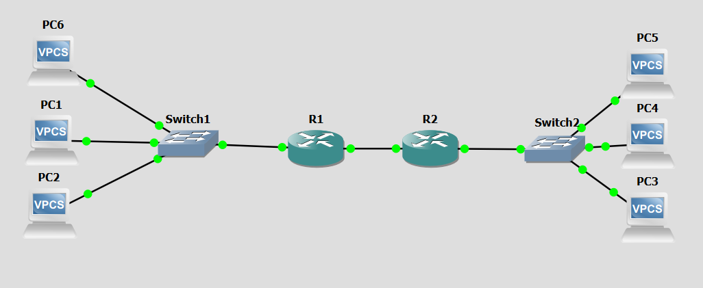
*Figure 5 — La topologie dans GNS3 : 3 PC – Switch1 – R1 – R2 – Switch2 – 3 PC.*

---

## 3. Configurer le routeur R1 (adresse IP + DHCP)

### 3.1 Nom et adresse IP de l'interface

```bash
R1# conf t                                   ! entrer en mode configuration
R1(config)# hostname R1_JP                   ! renommer le routeur
R1_JP(config)# interface GigabitEthernet1/0   ! interface vers le switch des PC
R1_JP(config-if)# ip address 192.168.69.9 255.255.255.0
R1_JP(config-if)# no shutdown                 ! allumer l'interface (éteinte par défaut)
R1_JP(config-if)# end
R1_JP# show ip interface brief                ! vérifier : Gi1/0 doit être "manual" et "up"
```

> [!WARNING]
> **Point de vigilance** : sur Cisco, une interface est **éteinte par défaut** (`administratively down`). Sans `no shutdown`, l'adresse IP est bien là… mais rien ne passe.

### 3.2 Le serveur DHCP

Le DHCP permet à chaque nouveau PC branché de **recevoir automatiquement** une adresse IP, un masque et une passerelle.

```bash
R1_JP# conf t
R1_JP(config)# ip dhcp excluded-address 192.168.69.9   ! ne jamais donner l'adresse du routeur
R1_JP(config)# ip dhcp pool LAN1                       ! créer le "pool" d'adresses
R1_JP(dhcp-config)# network 192.168.69.0 255.255.255.0 ! le réseau à distribuer
R1_JP(dhcp-config)# default-router 192.168.69.9        ! la passerelle donnée aux PC
R1_JP(dhcp-config)# end
R1_JP# wr                                              ! sauvegarder (sinon tout est perdu au redémarrage)
```

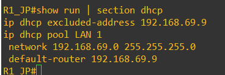
*Figure 6 — Vérification sur R1 avec `show run | section dhcp`.*

> [!NOTE]
> **Astuce** : `wr` ne fonctionne pas depuis le mode configuration (« Invalid input »). Il faut d'abord faire `end`, ou taper `do wr`.

---

## 4. Configurer R2 (même principe, autre réseau)

```bash
R2# conf t
R2(config)# hostname R2_JP
R2_JP(config)# interface GigabitEthernet1/0
R2_JP(config-if)# ip address 192.168.70.11 255.255.255.0
R2_JP(config-if)# no shutdown
R2_JP(config-if)# exit
R2_JP(config)# ip dhcp excluded-address 192.168.70.11
R2_JP(config)# ip dhcp pool LAN2
R2_JP(dhcp-config)# network 192.168.70.0 255.255.255.0
R2_JP(dhcp-config)# default-router 192.168.70.11
R2_JP(dhcp-config)# end
R2_JP# wr
```

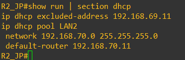
*Figure 7 — Le pool `LAN2` de R2. (La ligne `excluded-address` visible ici est un reste d'erreur, expliqué dans la partie 9.3.)*

---

## 5. Les PC reçoivent leur adresse par DHCP

Sur chaque PC virtuel (VPCS), une seule commande suffit :

```bash
PC1> ip dhcp      ! demande une adresse au routeur -> "DORA IP 192.168.69.2/24 GW 192.168.69.9"
PC1> show ip      ! affiche l'adresse, la passerelle et le serveur DHCP
PC1> save         ! garde la config du PC
```

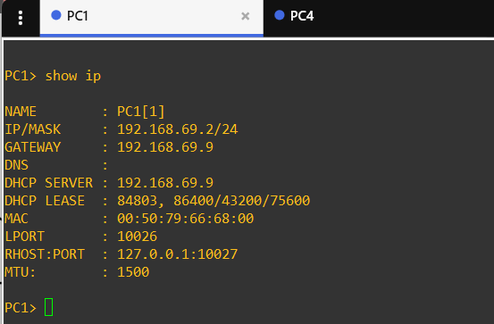

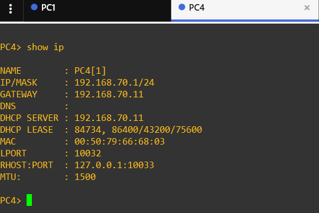
*Figures 8 et 9 — PC1 reçoit `192.168.69.2` de R1, PC4 reçoit `192.168.70.1` de R2. Chaque PC a la bonne passerelle et le bon serveur DHCP.*

Côté routeurs, `show ip dhcp binding` liste toutes les adresses distribuées, avec l'adresse MAC du PC qui l'a reçue :

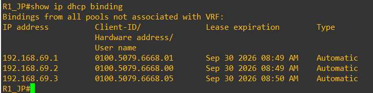
*Figure 10 — R1 a distribué 3 adresses dans le `192.168.69.0/24`.*

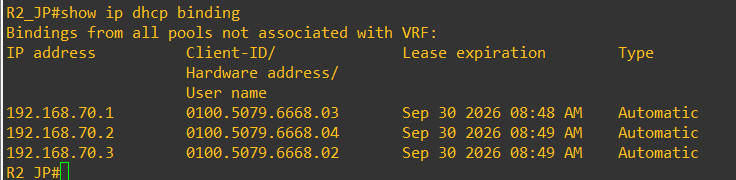
*Figure 11 — R2 a distribué 3 adresses dans le `192.168.70.0/24`.*

> [!TIP]
> **Test du DHCP** : j'ai ajouté des PC supplémentaires de chaque côté (PC5, PC6) pour vérifier que le DHCP donnait bien une **nouvelle adresse différente** à chaque appareil. ✔

---

## 6. Relier les deux réseaux

À ce stade, chaque côté fonctionne tout seul, mais **R1 ne sait pas où se trouve le réseau `.70`** (et inversement). Un routeur ne connaît que les réseaux branchés directement sur lui. Il faut donc :

1. donner une adresse au câble entre R1 et R2 (le « pont » `192.168.100.0/24`) ;
2. ajouter une **route statique** sur chaque routeur.

```bash
# ---- Sur R1 ----
R1_JP# conf t
R1_JP(config)# interface GigabitEthernet2/0
R1_JP(config-if)# ip address 192.168.100.1 255.255.255.0
R1_JP(config-if)# no shutdown
R1_JP(config-if)# exit
R1_JP(config)# ip route 192.168.70.0 255.255.255.0 192.168.100.2   ! "pour aller au .70, passe par R2"
R1_JP(config)# end
R1_JP# wr

# ---- Sur R2 ----
R2_JP# conf t
R2_JP(config)# interface GigabitEthernet2/0
R2_JP(config-if)# ip address 192.168.100.2 255.255.255.0
R2_JP(config-if)# no shutdown
R2_JP(config-if)# exit
R2_JP(config)# ip route 192.168.69.0 255.255.255.0 192.168.100.1   ! "pour aller au .69, passe par R1"
R2_JP(config)# end
R2_JP# wr
```

La table de routage de R1 (`show ip route`) montre alors ses 2 réseaux branchés (`C`) et la route ajoutée (`S` = statique) :

```
C    192.168.69.0/24  is directly connected, GigabitEthernet1/0
C    192.168.100.0/24 is directly connected, GigabitEthernet2/0
S    192.168.70.0/24  [1/0] via 192.168.100.2
```

> [!WARNING]
> **Point de vigilance** : il faut une route **sur les deux routeurs**. Avec une seule, le ping part… mais la réponse ne sait pas revenir.

Côté PC, **rien à changer** : la passerelle reçue par DHCP (`default-router`) leur dit déjà d'envoyer à leur routeur tout ce qui sort de leur réseau.

---

## 7. Les tests

| # | Test | Depuis → vers | Résultat |
|---|---|---|---|
| 1 | PC → sa passerelle | PC1 → R1 (`192.168.69.9`) | ✔ |
| 2 | Routeur → routeur (pont) | R1 → R2 (`192.168.100.2`) | ✔ |
| 3 | LAN 1 → LAN 2 | PC1 → PC4 (`192.168.70.1`) | ✔ `ttl=62` |
| 4 | LAN 2 → LAN 1 | PC4 → PC6 (`192.168.69.3`) | ✔ `ttl=62` |
| 5 | PC → routeur d'en face | PC6 → R2 (`192.168.70.11`) | ✔ `ttl=254` |

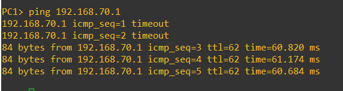
*Figure 12 — PC1 joint PC4 de l'autre côté. Les 2 premiers `timeout` sont normaux (le temps que les routeurs trouvent les adresses MAC avec ARP).*

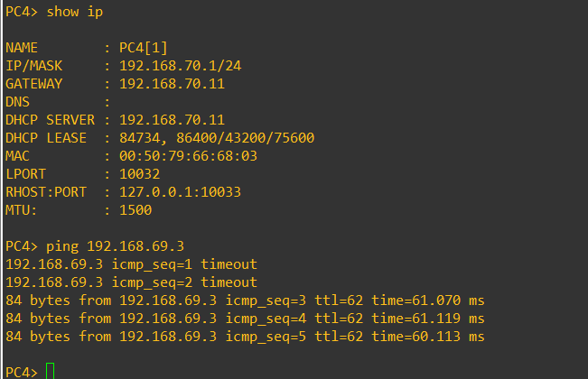
*Figure 13 — Et dans l'autre sens : PC4 joint PC6.*

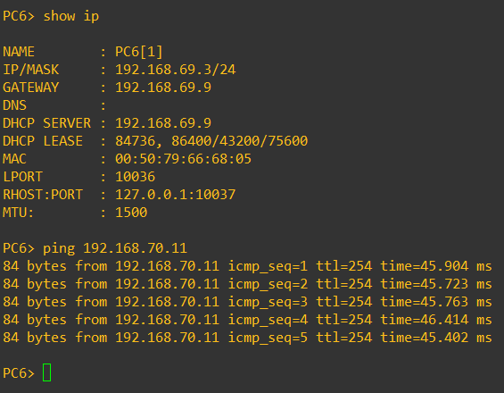
*Figure 14 — PC6 (LAN 1) joint directement l'interface de R2 dans le LAN 2.*

> [!NOTE]
> **Lire le TTL, la preuve que ça passe par les routeurs**
> Un PC VPCS envoie ses paquets avec un TTL de **64**, et **chaque routeur traversé enlève 1**.
> - Entre deux PC du même réseau : `ttl=64` (aucun routeur).
> - Entre PC1 et PC4 : `ttl=62` → le paquet a bien traversé **R1 puis R2**. ✔
> - Quand c'est R2 qui répond : il part de **255**, R1 enlève 1 → `ttl=254`. ✔

---

## 8. Bonus : le DHCP vu dans Wireshark

J'ai lancé une capture sur le câble **R1 ↔ Switch1** pendant le démarrage des PC. On y voit les 4 étapes du DHCP, qu'on appelle **DORA** :

| Temps | Source → Destination | Message | Explication |
|---|---|---|---|
| 0,00 s | `0.0.0.0` → `255.255.255.255` | **D**iscover | Le PC (qui n'a pas encore d'adresse) crie à tout le réseau : « y a-t-il un serveur DHCP ? » |
| 0,02 s | R1 → réseau (ARP) | *vérification* | R1 vérifie que `192.168.69.2` n'est pas déjà utilisée (pas de réponse = libre) |
| 2,02 s | `192.168.69.9` → `192.168.69.2` | **O**ffer | R1 propose l'adresse `192.168.69.2` |
| 3,01 s | `0.0.0.0` → `255.255.255.255` | **R**equest | Le PC répond : « je la prends » |
| 3,03 s | `192.168.69.9` → `192.168.69.2` | **A**CK | R1 confirme : l'adresse est attribuée ✔ |

*Extrait de la capture pour PC1 (MAC `00:50:79:66:68:00`). Juste après, le PC envoie 3 ARP sur sa propre adresse pour vérifier qu'il n'y a pas de doublon, puis ses premiers pings vers R1 réussissent.*

---

## 9. Les problèmes rencontrés (et comment je les ai réglés)

Tout n'a pas marché du premier coup, et c'est là que j'ai le plus appris.

### 9.1 Fautes de frappe dans les commandes

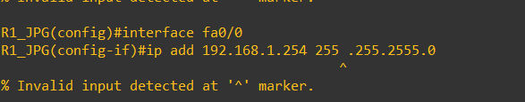
*Figure 15 — `255 .255.2555.0` : un espace et un 5 de trop, IOS refuse la commande et le `^` montre où est l'erreur.*

**Solution** : lire le `^`, retaper la commande correctement. J'ai aussi appris les raccourcis (`conf t`, `int gi1/0`, `ip add`, `sh ip int br`).

### 9.2 Interface qui ne monte pas

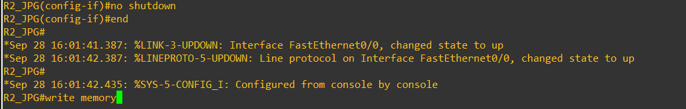
*Figure 16 — Après `no shutdown`, les messages `%LINK-3-UPDOWN … changed state to up` confirment que l'interface est allumée.*

### 9.3 Le PC4 ne reçoit pas d'adresse (« Can't find dhcp server »)

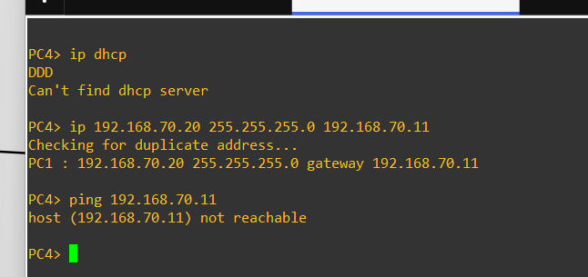
*Figure 17 — PC4 ne trouve pas de DHCP, et même avec une IP fixe il ne joint pas `192.168.70.11`.*

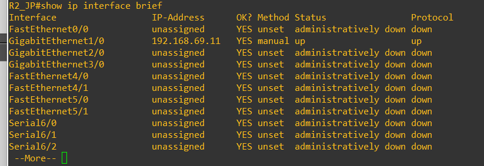
*Figure 18 — La cause : l'interface Gi1/0 de R2 avait l'adresse `192.168.69.11` (réseau de R1) au lieu de `192.168.70.11`.*

**Diagnostic** : le pool DHCP de R2 distribue le réseau `192.168.70.0/24`, mais l'interface de R2 était dans le `192.168.69.0/24`. Le routeur ne répondait donc pas aux demandes DHCP sur cette interface, et PC4 ne pouvait pas joindre une passerelle qui n'était pas dans son réseau.

**Solution** : corriger l'adresse de l'interface.

```bash
R2_JP(config)# interface GigabitEthernet1/0
R2_JP(config-if)# ip address 192.168.70.11 255.255.255.0
```

**Un reste de cette erreur**, repéré en relisant la config pour ce post : la ligne `ip dhcp excluded-address 192.168.69.11` (Figure 7) exclut une adresse qui n'est même pas dans le réseau de R2. Correction :

```bash
R2_JP(config)# no ip dhcp excluded-address 192.168.69.11
R2_JP(config)# ip dhcp excluded-address 192.168.70.11
R2_JP(config)# end
R2_JP# wr
```

### 9.4 Le projet GNS3 s'ouvre sur une page blanche

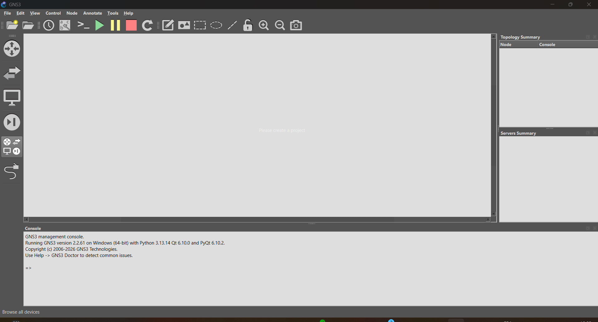
*Figure 19 — Un jour, GNS3 s'est ouvert sans rien : ni topologie, ni appareils.*

**Solution** : le projet n'était pas perdu. Le dossier du projet contenait toujours le fichier `Install-Routeur+PC.gns3` et le sous-dossier `project-files` (où GNS3 garde les configurations des routeurs et des PC), ce qui m'a permis de récupérer mon travail.

**Leçon** : faire `wr` sur chaque routeur **et** `Ctrl + S` dans GNS3 après chaque étape importante.

---

## 10. Ce que j'ai appris

- **Un routeur relie des réseaux différents** : c'est pour ça qu'on a besoin d'un plan d'adressage clair *avant* de commencer.
- **Le DHCP n'est pas magique** : le pool doit correspondre au réseau de l'interface, et il faut exclure l'adresse du routeur.
- **Le routage va dans les deux sens** : une route pour l'aller, une pour le retour.
- **Vérifier à chaque étape** (`show ip interface brief`, `show ip route`, `show ip dhcp binding`, `ping`) permet de trouver une erreur tout de suite au lieu de chercher partout à la fin.
- **Le TTL et Wireshark** permettent de *prouver* ce qui se passe réellement sur le réseau.

## 11. Pour aller plus loin

- [ ] Remplacer les routes statiques par du **routage dynamique (OSPF)**
- [ ] Ajouter un serveur **DNS** dans les pools DHCP (`dns-server`)
- [ ] Réserver une plage d'adresses pour de futurs serveurs/imprimantes (`excluded-address .1 .20`)
- [ ] Découper un réseau avec des **VLAN** sur un switch manageable
- [ ] Sauvegarder les configurations des routeurs sur un serveur **TFTP**

---

## Récap : toutes les commandes

```bash
# ===== Routeur : IP d'interface =====
conf t
hostname R1_JP
interface GigabitEthernet1/0
 ip address 192.168.69.9 255.255.255.0
 no shutdown
 exit

# ===== Routeur : DHCP =====
ip dhcp excluded-address 192.168.69.9
ip dhcp pool LAN1
 network 192.168.69.0 255.255.255.0
 default-router 192.168.69.9
 exit

# ===== Routeur : lien vers l'autre routeur + route =====
interface GigabitEthernet2/0
 ip address 192.168.100.1 255.255.255.0
 no shutdown
 exit
ip route 192.168.70.0 255.255.255.0 192.168.100.2
end
wr

# ===== Vérifications routeur =====
show ip interface brief
show ip route
show ip dhcp binding
show run | section dhcp

# ===== PC (VPCS) =====
ip dhcp
show ip
ping 192.168.70.1
save
```

---

*Projet réalisé dans le cadre de ma 1re année d'apprentissage CFC informaticien, à partir d'un exercice du cours IT Essentials (ICT-187), étendu de ma propre initiative.*

---

<sub>Projet réalisé dans le cadre de ma formation CFC informaticien au Geneva Institute of Technology.</sub>

**[⬅ Retour à tous les projets](../README.md)** · [Mon profil](https://jp-gallego.github.io) · [LinkedIn](https://www.linkedin.com/in/jean-pierre-gallego-santillan-6b4701433)
